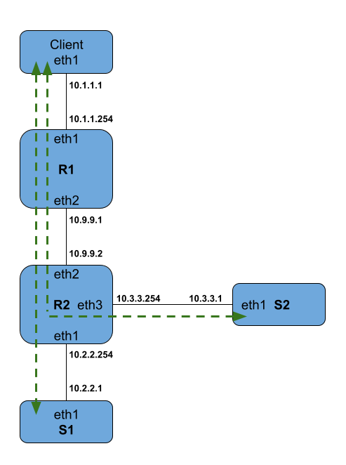

# Guida Lab — Modulo S5: Firewall — iptables/nftables in pratica
**Corso**: Lab Sicurezza Informatica T
**Materiale**: "\*\* LAB \*\* Firewall [1 aprile]" (+ teoria "Firewall [20 mar]", "Configurazione del packet filter di Linux [1 apr]" per i concetti richiamati)
**VM**: Parrot OS in VirtualBox — architettura a 5 container Docker generata da uno script (`nftlab.sh`, scaricabile da Virtuale insieme al LAB)
**Prerequisiti**: `lezione_moduloS5_firewall_iptables.md` (sintassi iptables/nft, conntrack, hook di netfilter, tabelle NAT) — verificare di averla letta prima di iniziare

---

## Setup

L'intero lab gira su un'architettura fissa a 5 nodi, descritta dalla figura del LAB PDF (immagine originale: `diagramma_moduloS5_architettura.png`, in questa stessa cartella):



Riassunta in ASCII per riferimento rapido:

```
Client (eth1: 10.1.1.1) ---10.1.1.0/24--- R1 (eth1: 10.1.1.254)
                                          R1 (eth2: 10.9.9.1) ---10.9.9.0/24--- R2 (eth2: 10.9.9.2)
                                                                                R2 (eth1: 10.2.2.254) ---10.2.2.0/24--- S1 (eth1: 10.2.2.1)
                                                                                R2 (eth3: 10.3.3.254) ---10.3.3.0/24--- S2 (eth1: 10.3.3.1)
```

Route statiche già configurate (le frecce verdi tratteggiate della figura): Client ↔ S1 e Client ↔ S2, entrambe passanti per R1 → R2. R1 e R2 sono router puri (instradano, non sono la destinazione finale del traffico); S1 e S2 sono i server; Client è l'unico client.

1. Scarica `nftlab.sh` da Virtuale (facoltativo ma fortemente consigliato — automatizza tutto il resto di questo passo).
2. Crea una cartella dedicata (es. `~/nftlab`), spostaci lo script.
3. `chmod +x nftlab.sh`
4. `./nftlab.sh` senza parametri: costruisce e avvia i 5 container. **Ogni volta che lo rilanci**, prima ferma ed elimina i container/immagini precedenti e li ricrea da zero — utile per ripartire puliti tra un esercizio e l'altro, ma vuol dire che le regole firewall applicate manualmente in un esercizio precedente si perdono a un nuovo lancio. Lo script imposta anche degli alias per accedere alla shell di ciascun container senza dover ricordare nomi/ID Docker.

> ⚠️ Qui non serve lo snapshot VM tipico degli altri lab Security (nessun esercizio di compromissione): il "reset pulito" equivalente è rilanciare `nftlab.sh`, che ricrea i container da zero. Se un esercizio di firewalling ti lascia in uno stato confuso (es. ti sei chiuso fuori da un container con una default policy troppo aggressiva), rilancia lo script invece di provare a districarti da dentro.

---

## Threat model

- **Prospettiva attaccante**: un router mal configurato lascia passare traffico tra segmenti che dovrebbero restare isolati (es. SSH raggiungibile da una subnet che non dovrebbe poterlo fare), oppure un NAT scritto senza pensare alla via di ritorno espone involontariamente un servizio interno o lo rende raggiungibile da un percorso non previsto.
- **Prospettiva difensore**: regole ordinate dal caso più selettivo al più generale (mai il contrario, altrimenti la regola generale "vince" per prima ed è come non aver scritto l'eccezione), stateful filtering per non dover scrivere a mano il traffico di ritorno di ogni servizio, logging per vedere concretamente cosa la default policy sta scartando, contatori per accorgersi di pattern di traffico anomali prima che diventino un incidente.

---

## Esercizi

> Lorenzo digita tutti i comandi. La guida li fornisce, non li esegue.

### Esercizio 1 — Packet filter su endpoint (INPUT/OUTPUT)

**Obiettivo**: configurare INPUT/OUTPUT con default policy `drop` senza perdere l'accesso SSH alla VM/container su cui stai lavorando.

**Concetto**: un PF può gestire traffico *originato da* o *diretto a* un processo della stessa macchina — è il compito degli hook `input`/`output` (non `forward`, che è per traffico in transito). Il rischio concreto qui è "chiudersi fuori": se applichi una default policy drop senza aver prima permesso il tuo stesso traffico SSH, perdi l'accesso alla macchina che stai configurando.

**Comandi**:
```bash
echo $SSH_CONNECTION
ip a
```
Poi lo scheletro di base, da completare, salvare in un file e caricare:
```
table filter{
    chain forward{ type filter hook forward priority filter; policy drop; }
    chain input{
        type filter hook input priority filter; policy drop;
        iif lo accept;
        # regole di accesso consentito in ingresso
    }
    chain output{
        type filter hook output priority filter; policy drop;
        oif lo accept;
        # regole di traffico consentito in uscita
    }
}
```
```bash
sudo nft -f filename
```

**Anatomia**:
- `echo $SSH_CONNECTION`: variabile d'ambiente che SSH imposta con IP:porta client e IP:porta server della sessione corrente — ti dice esattamente quale traffico devi lasciar passare *prima* di applicare la default policy, altrimenti la disconnetti da sola.
- `ip a`: elenca interfacce e indirizzi assegnati — incrocialo con l'output di `$SSH_CONNECTION` per essere sicuro di sapere su quale interfaccia/indirizzo arriva la tua connessione reale (non fidarti a memoria del diagramma: verificalo sempre sul container).
- `iif lo accept` / `oif lo accept`: `iif`/`oif` = interfaccia di ingresso/uscita; `lo` = loopback. Va sempre accettato perché moltissimi servizi locali (risoluzione DNS locale, socket Unix su TCP locale, ecc.) passano da lì — bloccarlo rompe il sistema anche se l'intento era filtrare solo il traffico di rete esterno.
- `type filter hook input priority filter; policy drop;`: come in lezione — dichiari tipo/hook/priority della catena; qui la default policy è `drop`, quindi *tutto* ciò che non fa match con una regola esplicita viene scartato. La regola che preserva la tua sessione SSH corrente va scritta PRIMA di applicare il file (non aggiunta "dopo aver provato", altrimenti nel mezzo perdi l'accesso).

**Output atteso**: dopo `sudo nft -f filename`, la sessione SSH corrente resta attiva; un nuovo tentativo di connessione da un host non esplicitamente permesso non riceve risposta o viene rifiutato.

**Cosa verificare**: da un **secondo** terminale (senza chiudere quello che stai usando ora), prova una nuova connessione — se fallisce mentre la tua sessione attuale regge, hai preservato correttamente l'accesso. ⚠️ Se ti disconnetti e non riesci a rientrare: quasi certamente la regola per la tua sessione non era presente PRIMA di applicare la policy drop, oppure indirizzo/porta non corrispondono a quanto letto da `$SSH_CONNECTION`.

---

### Esercizio 2 — Packet filter in instradamento (FORWARD)

**Obiettivo**: restringere l'inoltro tra le reti Client/S1/S2 ai soli flussi previsti dallo schema (Client↔S1, Client↔S2), bloccando il resto.

**Concetto**: i router (R1, R2) non generano/ricevono traffico per un proprio processo: lo inoltrano soltanto. La catena rilevante è `FORWARD`, non `INPUT`/`OUTPUT`.

**Comandi** — nftables (in un file, poi `nft -f FILENAME`):
```
flush chain filter FORWARD
table ip filter {
    chain FORWARD {
        type filter hook forward priority filter; policy drop;
        ip saddr 10.1.1.0/24 ip daddr 10.2.2.0/24 accept
        ip daddr 10.1.1.0/24 ip saddr 10.2.2.0/24 accept
        ip saddr 10.1.1.0/24 ip daddr 10.3.3.0/24 accept
        ip daddr 10.1.1.0/24 ip saddr 10.3.3.0/24 accept
    }
}
```
iptables equivalente:
```bash
iptables -A FORWARD -s 10.1.1.0/24 -d 10.2.2.0/24 -j ACCEPT
iptables -A FORWARD -s 10.2.2.0/24 -d 10.1.1.0/24 -j ACCEPT
iptables -A FORWARD -s 10.1.1.0/24 -d 10.3.3.0/24 -j ACCEPT
iptables -A FORWARD -s 10.3.3.0/24 -d 10.1.1.0/24 -j ACCEPT
iptables -P FORWARD DROP
```

**Anatomia**:
- `flush chain filter FORWARD` / `iptables -F FORWARD`: svuota la catena prima di ricaricare — evita regole duplicate se rilanci lo stesso file più volte.
- Le quattro regole `ip saddr ... ip daddr ... accept`: coprono ENTRAMBE le direzioni di ENTRAMBE le coppie di reti (Client↔S1 e Client↔S2) — qui non c'è ancora stateful filtering (arriva all'esercizio 4), quindi devi elencare esplicitamente sia andata sia ritorno.
- ⚠️ **Errore ricorrente da evitare** (pattern generale Security, vedi `errori_frequenti.md`): non dare per scontati gli IP letti qui — verifica sempre con `ip a` sul container reale prima di scrivere una regola, anche se questa è un'architettura fissa da script (a differenza di un vero nmap con IP dinamici, qui *dovrebbero* coincidere col diagramma, ma il principio "verifica, non assumere" va comunque mantenuto come abitudine).
- `iptables -P FORWARD DROP`: la default policy va impostata per ULTIMA, dopo le regole di ACCEPT — altrimenti rischi di bloccare il traffico che stai ancora configurando (stesso principio di attenzione dell'esercizio 1, qui meno pericoloso perché FORWARD non tocca il tuo accesso SSH al router).

**Output atteso**: `iptables -vnL FORWARD` mostra le 4 regole nell'ordine di inserimento, con la policy DROP in fondo.

**Cosa verificare**:
```bash
iptables -F FORWARD
# reinserisci le stesse 4 regole con -I invece di -A
```
Qui l'ordine `-I` vs `-A` **non cambia nulla**, perché le 4 regole sono ortogonali (nessuna condizione si sovrappone a un'altra) — utile contro-esempio: "l'ordine è sempre fondamentale" vale quando le regole SI SOVRAPPONGONO, non quando sono a compartimenti stagni come qui.

---

### Esercizio 3 — Elencare, aggiungere e togliere regole (handle)

**Obiettivo**: padroneggiare `add`/`insert`/`delete`/`replace` con gli handle di nftables.

**Concetto**: ogni regola nftables caricata riceve un **handle** (numero identificativo) — è il modo per riferirsi a una regola precisa quando la catena ha più righe simili tra loro.

**Comandi**:
```bash
nft add rule filter FORWARD tcp dport 2222 drop

nft list ruleset            # tutto il set di regole
nft list table filter
nft list chain filter FORWARD
nft -a list ruleset          # -a mostra anche gli handle
```
Output di esempio da `nft -a list ruleset`:
```
table ip filter {  # handle 2
    chain FORWARD {  # handle 1
        type filter hook forward priority filter; policy drop;
        ip saddr 10.1.1.0/24 ip daddr 10.2.2.0/24 accept  # handle 2
        ip daddr 10.1.1.0/24 ip saddr 10.2.2.0/24 accept  # handle 3
        ip saddr 10.1.1.0/24 ip daddr 10.3.3.0/24 accept  # handle 4
        ip daddr 10.1.1.0/24 ip saddr 10.3.3.0/24 accept  # handle 5
        tcp dport 2222 drop  # handle 6
    }
}
```
```bash
nft add rule TABELLA CATENA position X ...      # inserisce DOPO la regola con handle X
nft insert rule TABELLA CATENA position X ...   # inserisce PRIMA della regola con handle X
nft delete rule filter FORWARD handle 6
nft replace rule filter FORWARD handle 6 tcp dport 8080 drop
```

**Anatomia**:
- `add rule ... tcp dport 2222 drop` (senza `position`): aggiunge in fondo — stesso comportamento di `-A` in iptables.
- `-a` in `list`: senza, gli handle non compaiono affatto — dettaglio facile da dimenticare, e che poi impedisce `delete`/`replace` mirati.
- `position X` in `add`/`insert`: simmetrici di proposito — `add ... position X` mette la nuova regola DOPO quella con handle X, `insert ... position X` la mette PRIMA.
- `delete rule ... handle 6`: in nftables l'unico modo attualmente supportato per cancellare una regola precisa è per handle. In iptables invece puoi anche ripetere tutti i parametri della regola originale (`iptables -D FORWARD -p tcp --dport 2222 -j DROP`) senza conoscerne un numero — nftables prevede di supportarlo in futuro, ma al momento no.
- `replace`: stessa logica di `delete` ma seguita dalla nuova definizione — sostituisce sul posto invece di cancellare e reinserire in fondo.

**Output atteso**: dopo `delete`/`replace`, `nft -a list ruleset` conferma che la regola con quell'handle è sparita/cambiata; gli altri handle restano stabili (non si rinumerano).

**Cosa verificare**: prova a cancellare una regola a caso e riverifica che l'handle indicato sia davvero sparito e che il resto della catena sia intatto.

---

### Esercizio 4 — Stateful filtering di servizi (SSH selettivo)

**Obiettivo**: SSH erogato **solo** da S2 (10.3.3.1), raggiungibile **solo** da Client (10.1.1.1); tutto il resto del traffico Client↔server continua a funzionare come prima.

**Concetto**: le regole vanno ordinate dal caso più selettivo al più generale — prima le eccezioni specifiche (consenti SSH Client→S2, blocca SSH ovunque altro), poi le regole generali già esistenti dall'esercizio 2. Qui entra lo **stateful filtering** (visto in lezione): le richieste NUOVE vengono approvate, i pacchetti di ritorno solo se corrispondono a una richiesta già vista (`ct state established`).

**Comandi** — se non vuoi usare gli handle, con `insert` (che mette sempre in testa) devi inserire le regole **in ordine inverso** rispetto a come vuoi che appaiano nella lista finale:
```bash
nft insert rule filter FORWARD tcp dport 22 drop
nft insert rule filter FORWARD tcp sport 22 drop
nft insert rule filter FORWARD ip daddr 10.1.1.1 ip saddr 10.3.3.1 tcp sport 22 ct state established accept
nft insert rule filter FORWARD ip saddr 10.1.1.1 ip daddr 10.3.3.1 tcp dport 22 accept
```
iptables equivalente (`-I` inserisce sempre in testa, stessa logica di ordine inverso):
```bash
iptables -I FORWARD -p tcp --dport 22 -j DROP
iptables -I FORWARD -p tcp --sport 22 -j DROP
iptables -I FORWARD -p tcp -s 10.1.1.1 -d 10.3.3.1 --dport 22 -j ACCEPT
iptables -I FORWARD -p tcp -s 10.3.3.1 -d 10.1.1.1 --sport 22 -m state --state ESTABLISHED -j ACCEPT
```

**Anatomia**:
- Perché l'ordine di inserimento è invertito: ogni `insert`/`-I` mette la nuova regola davanti a TUTTE quelle esistenti — l'ultima che inserisci è quella che finisce più in alto. Per ottenere la lista finale "consenti Client→S2, consenti ritorno established, blocca SSH generico, poi le regole generali" devi inserire a partire dall'ultima riga che vuoi vedere e risalire.
- `tcp dport 22 drop` / `tcp sport 22 drop`: bloccano SSH in ENTRAMBE le direzioni per default — sono le regole "generali di eccezione", scavalcate SOLO dalle due regole più specifiche che finiscono sopra di loro.
- `ip saddr 10.1.1.1 ip daddr 10.3.3.1 tcp dport 22 accept`: il pacchetto che apre la connessione (Client→S2) — nessuna condizione di stato, è la richiesta NUOVA.
- `ip daddr 10.1.1.1 ip saddr 10.3.3.1 tcp sport 22 ct state established accept`: il traffico di RITORNO (S2→Client) — qui serve `ct state established`, altrimenti riapriresti un buco generico per qualunque pacchetto con sorgente porta 22, non solo le risposte legittime.

**Output atteso**: `nft list ruleset` mostra le 4 nuove regole in cima alla catena FORWARD, seguite dalle 4 regole generali dell'esercizio 2, con la default policy drop in fondo.

**Cosa verificare**: da Client, SSH verso S2 funziona; SSH verso S1 (o qualunque altro host) viene bloccato; il resto del traffico Client↔S1/S2 (non SSH) continua a funzionare.

---

### Esercizio 5 — Le stesse regole su più macchine

**Obiettivo**: replicare il filtraggio SSH selettivo su tutta la catena Client-R1-R2-S2, non solo su un router.

**Concetto**: se la specifica richiede che il filtraggio avvenga su ogni host coinvolto nel flusso, le regole vanno installate ovunque — e il ruolo di client/server è asimmetrico rispetto allo stato:
- **Client**: apre spontaneamente la connessione in uscita (non puoi pretendere `ct state established` su quel pacchetto, è lui il primo), ma accetta un pacchetto di ritorno solo se corrisponde a una richiesta già vista → `ct state established` sul traffico IN ENTRATA.
- **S2 (server)**: accetta la richiesta in ingresso senza precondizioni di stato, ma lascia USCIRE una risposta solo se corrisponde a una richiesta ricevuta → `ct state established` sul traffico IN USCITA.
- **R1, R2 (router)**: vedono entrambe le direzioni come traffico in transito (FORWARD) — stessa logica, applicata sia all'andata sia al ritorno.

⚠️ **Punto sottile**: per la parte "centrale" dell'esercizio basta la catena FORWARD sui router, ma per rispettare la specifica di filtraggio stringente **ovunque** devi configurare anche INPUT e OUTPUT su Client e S2 — fermarsi al solo FORWARD è un errore comune.

**Soluzione di riferimento fornita dal PDF**: `rules.tgz` (da scaricare da Virtuale se vuoi confrontare la tua soluzione).

**Cosa verificare**: ripeti i test dell'esercizio 4, ma con le regole installate su TUTTI gli host della catena — il comportamento visibile da Client deve restare identico, ma ora ogni host si protegge anche autonomamente.

---

### Esercizio 6 — Logging

**Obiettivo**: vedere quali pacchetti vengono scartati dalla default policy, prima che spariscano nel nulla.

**Concetto**: un DROP silenzioso rende impossibile il debug — il logging (`log prefix` in nft, `LOG --log-prefix` in iptables) stampa nel log del kernel i pacchetti che passano da quella regola, SENZA impedirne il normale destino successivo (`log` è uno statement non-terminante: va aggiunto oltre al verdict, non al posto suo).

**Comandi** — nftables:
```bash
nft add rule filter INPUT log prefix "input_end"
nft add rule filter OUTPUT log prefix "output_end"
nft add rule filter FORWARD log prefix "forward_end"
```
iptables:
```bash
iptables -A INPUT -j LOG --log-prefix "input_end"
iptables -A OUTPUT -j LOG --log-prefix "output_end"
iptables -A FORWARD -j LOG --log-prefix "forward_end"
```
Osservazione in tempo reale:
```bash
journalctl -k -f
# sistemi più vecchi: tail -f /var/log/kern.log
```

**Anatomia**:
- Posizione della regola LOG: va messa in fondo alla catena, **appena prima** della default policy DROP (cioè dopo tutte le regole di ACCEPT) — così logghi esattamente i pacchetti che stanno per essere scartati, non quelli già accettati da una regola precedente.
- `-k`: filtra solo i messaggi del kernel (dove arriva il log di netfilter), non tutto il log di sistema.
- `-f`: segue il log in tempo reale, come `tail -f`.
- Opzioni aggiuntive su `log`: `level PRIO` (priorità del messaggio), `snaplen BYTES` (quanto payload includere — ⚠️ da usare con cautela, può loggare dati sensibili), `queue-threshold QLEN` (quanti pacchetti accumulare in kernel space prima di inviarli al log — alto = meno context switch ma messaggi meno tempestivi, basso = il contrario).

**Output atteso**: generando traffico vietato (es. una connessione verso host/porta non permessi), il log mostra righe col prefisso scelto seguite dai dettagli del pacchetto (IP sorgente/destinazione, protocollo, porte).

**Cosa verificare**: genera traffico che sai per certo essere bloccato dalle regole precedenti e conferma che compaia nel log col prefisso giusto — se non compare nulla, la regola LOG probabilmente non è nella posizione corretta della catena.

---

### Esercizio 7 — NAT

**Obiettivo**: far sì che R1 "finga" di accettare SSH da Client sul proprio indirizzo, ridirigendo in realtà la connessione a S1.

**Concetto**: qui si usa la tabella `nat`, non `filter` — il DNAT altera la destinazione del pacchetto (visto in lezione), agganciato all'hook `prerouting` perché la traduzione deve avvenire PRIMA che il router decida come instradare il pacchetto.

**Comandi** — nftables (da file, poi `nft -f FILE`):
```
table nat {
    chain PREROUTING {
        type nat hook prerouting priority dstnat
        iif eth1 ip saddr 10.1.1.1 ip daddr 10.1.1.254 tcp dport 22 dnat to 10.2.2.1
    }
}
```
iptables:
```bash
iptables -t nat -I PREROUTING -p tcp -s 10.1.1.1 -d 10.1.1.254 --dport 22 -j DNAT --to-destination 10.2.2.1
```

**Anatomia**:
- `iif eth1`: la regola scatta solo per pacchetti che entrano su R1 dall'interfaccia eth1 — quella rivolta verso Client (vedi diagramma), non un'altra interfaccia di R1.
- `ip daddr 10.1.1.254`: R1 stesso, dal punto di vista di Client (il suo gateway) — Client crede di connettersi a R1.
- `dnat to 10.2.2.1`: la destinazione reale diventa **S1** — Client non se ne accorge, la traduzione avviene in modo trasparente prima del routing.
- `priority dstnat`: la priorità standard per operazioni di destination NAT in `prerouting` — determina l'ordine relativo rispetto ad altre catene agganciate allo stesso hook.

**Output atteso**: da Client, `ssh 10.1.1.254` in realtà apre una sessione su S1, non su R1.

**Cosa verificare** — le domande-guida del PDF stesso: **funziona? se no, cosa interferisce? come fai diagnosi?** Usa `tcpdump` per vedere se il pacchetto arriva effettivamente a R1 e se esce verso S1 con l'indirizzo tradotto, o se si perde per strada (es. la risposta di S1 non sa come tornare a Client attraverso la stessa traduzione).

**Variante più complessa** (proposta dal PDF senza soluzione dettagliata): configura R2 in modo che un ping di S1 verso R2 riceva risposta da S2, pur non avendo S1/S2 instradamento diretto tra loro. Qui serve **ingannare entrambi i lati**: DNAT sul pacchetto in ingresso (dirotta verso S2) e SNAT sulla risposta (fa sembrare che la risposta venga da R2, non da S2) — altrimenti S1 riceverebbe una risposta da un indirizzo che non ha mai contattato e la scarterebbe.

---

### Esercizio 8 — Catene custom

**Obiettivo**: organizzare le regole di filtraggio per un host specifico (S1, 10.2.2.1) in catene dedicate, invece di accumularle nella catena FORWARD generale.

**Concetto**: tutte le catene in nftables sono "custom" in senso stretto (nessuna è predefinita) — ma per ragionare in parallelo con iptables, chiamiamo "predefinite" quelle agganciate direttamente agli hook, e "custom" quelle raggiunte solo tramite un salto (`jump`) da una regola in una catena agganciata. Le catene custom servono a tenere ordinati set di regole numerosi, raggruppati per host/rete/protocollo.

**Esercizio assegnato dal PDF**: riprodurre con NFTABLES gli esempi sottostanti, scritti con IPTABLES:
```bash
iptables -N rules_from_S1
iptables -N rules_to_S1
iptables -I FORWARD -s 10.2.2.0/24 -j rules_from_LANS1
iptables -I FORWARD -d 10.2.2.0/24 -j rules_to_LANS1

# le macchine della subnet sono server ssh, http, https
for i in 22 80 443; do
    iptables -A rules_to_LANS1 -p tcp --dport $i -j ACCEPT
    iptables -A rules_from_LANS1 -p tcp --sport $i -m state --state ESTABLISHED -j ACCEPT
done

# le macchine della subnet sono client dns e ntp
for i in 53 123; do
    iptables -A rules_from_LANS1 -p udp --dport $i -j ACCEPT
    iptables -A rules_to_LANS1 -p udp --sport $i -m state --state ESTABLISHED -j ACCEPT
done

iptables -A rules_from_LANS1 -j LOG --log-prefix "outgoing packet not catched"
iptables -A rules_to_LANS1 -j LOG --log-prefix "incoming packet not catched"
```
⚠️ **Nota**: il PDF crea le catene come `rules_from_S1`/`rules_to_S1` con `-N`, ma poi le usa (salto da FORWARD e tutti i comandi successivi) come `rules_from_LANS1`/`rules_to_LANS1` — è un'incoerenza di nome presente nel materiale originale, non un errore tuo se te ne accorgi. Nella tua versione usa un nome unico e coerente per tutto l'esercizio.

**Anatomia**:
- `-N NOME`: crea la catena vuota, non ancora agganciata a nulla.
- `-I FORWARD -s 10.2.2.0/24 -j rules_from_LANS1`: il salto — ogni pacchetto FORWARD con sorgente nella subnet di S1 viene deviato a questa catena custom per un esame più dettagliato.
- Il doppio `for` (porte 22/80/443 vs 53/123): modella due ruoli diversi per la stessa subnet — da SERVER (accetta connessioni in ingresso su quelle porte, accetta il ritorno se established) e da CLIENT (fa richieste in uscita su porte DNS/NTP, accetta le risposte se established) — nota come cambiano `--dport`/`--sport` e `rules_to_LANS1`/`rules_from_LANS1` a seconda del ruolo.
- Le due regole LOG finali: catturano tutto ciò che non ha fatto match con nessuna regola sopra, prima che la catena custom restituisca implicitamente il controllo a FORWARD — permette di individuare traffico non previsto dalla specifica.

**Pulizia** (per rimuovere tutto senza lasciare residui):
```bash
iptables -F rules_from_LANS1
iptables -F rules_to_LANS1
iptables -D FORWARD -s 10.2.2.0/24 -j rules_from_LANS1
iptables -D FORWARD -d 10.2.2.0/24 -j rules_to_LANS1
iptables -X rules_from_LANS1
iptables -X rules_to_LANS1
```
Nota l'ordine: prima svuoti (`-F`), poi rimuovi i salti che puntano alla catena (`-D` sulle regole in FORWARD), solo ALLA FINE cancelli la catena stessa (`-X`) — `-X` fallisce se qualcosa punta ancora alla catena o se non è vuota.

**Output atteso**: `iptables -vnL FORWARD` mostra i salti verso le catene custom al posto di lunghe liste di regole dirette; `iptables -vnL rules_to_LANS1`/`rules_from_LANS1` mostrano il dettaglio.

**Cosa verificare**: traffico HTTP/HTTPS/SSH verso S1 passa; una porta non elencata finisce nella regola LOG finale invece che silenziosamente accettata o scartata senza traccia.

---

### Esercizio 9 — Contatori

**Obiettivo**: contare cumulativamente pacchetti e byte diretti verso/da un host specifico (S1, 10.2.2.1) su R2.

**Concetto**: in iptables ogni regola ha SEMPRE un contatore associato (anche se non lo guardi mai); in nftables il contatore va richiesto esplicitamente con lo statement `counter` — se non lo scrivi, non viene attivato.

**Esercizio assegnato dal PDF**: riprodurre con NFTABLES le stesse logiche esemplificate con IPTABLES:
```bash
iptables -N count_LANS1
iptables -I count_LANS1
iptables -I FORWARD -s 10.2.2.1 -j count_LANS1
iptables -I FORWARD -d 10.2.2.1 -j count_LANS1
```

**Anatomia**:
- `iptables -I count_LANS1` (senza altri argomenti dopo il nome catena): inserisce una regola VUOTA in testa alla catena custom — nessun match, nessun target esplicito, quindi fa SEMPRE match, e il suo contatore incrementa a ogni pacchetto che attraversa la catena, cumulativamente.
- Le due `-I FORWARD ... -j count_LANS1`: deviano verso la catena di conteggio sia il traffico CON sorgente S1 sia quello CON destinazione S1 — per questo il conteggio è cumulativo su entrambe le direzioni.
- ⚠️ **Attenzione all'ordine**: queste due regole di salto devono restare PRIMA di qualunque regola in FORWARD che potrebbe già intercettare (accettare o scartare) quei pacchetti — altrimenti il contatore non vede tutto il traffico.

**Lettura e reset**:
```bash
iptables -vnxL count_LANS1
# es. output: 4932  729300  all  --  *  *  0.0.0.0/0  0.0.0.0/0
#             ^pacchetti  ^byte totali cumulativi

iptables -vnxL -Z count_LANS1   # stampa E azzera atomicamente
```

**Anatomia**:
- `-v`: verbose (mostra i contatori). `-n`: non risolvere IP/porte in nomi. `-x`: mostra i numeri ESATTI invece che arrotondati (K/M/G) — essenziale per calcoli precisi su intervalli di tempo.
- `-Z`: azzera i contatori DOPO averli stampati, in un'unica operazione atomica. Perché deve essere atomica: se stampi e azzeri con due comandi separati, i pacchetti arrivati nell'intervallo tra i due comandi verrebbero persi dal conteggio del periodo successivo. Utile per misurare traffico per intervalli fissi (es. un ciclo che stampa+azzera ogni ora).
- Con nftables questo non è altrettanto immediato: serve ricorrere a contatori CON NOME invece che anonimi — sintassi su https://wiki.nftables.org/wiki-nftables/index.php/Counters.

**Output atteso**: il numero di pacchetti/byte cresce a ogni traffico generato verso/da S1; dopo un `-Z`, riparte da zero fino al prossimo traffico.

**Cosa verificare**: genera traffico noto (es. un ping con un numero fisso di pacchetti) verso S1 e conferma che il contatore incrementi esattamente di quella quantità.

---

## Famiglia d'esame

Tipologia: ⭐ **Iptables/NFTables**
Prova passata correlata: `SIMULAZIONI ESAMI/SICINF/IptablesNFTables.html` — eseguila al termine del lab, a chiusura del modulo.

## Connessioni

- **Con S1 (Enumerazione)**: dopo aver applicato le regole degli esercizi 2/4, un `nmap` da Client verso S1/S2 dovrebbe mostrare esattamente le porte che le regole lasciano passare — buon modo per autoverificarsi senza fidarsi solo della lettura delle regole.
- **Con S4 (Binary exploits)**: il DNAT dell'esercizio 7 è concettualmente l'opposto difensivo di `secret_function_remote` (es2b) — lì un servizio vulnerabile era esposto senza controllo; qui il NAT sposta/nasconde deliberatamente dove un servizio "sembra" essere, senza che il client se ne accorga.

<!-- AUTO-LINKS:START -->
## 🔗 Collegati

- [[appunti_moduloS5_firewall_iptables]]
- [[lezione_moduloS5_firewall_iptables]]

**Hub:** [[master_map_studio]] · [[concept_maps]] · [[metodo_studio_esami_pratici]]
<!-- AUTO-LINKS:END -->
