# Appunti — FI2 01: Dai linguaggi alle infrastrutture software

**Corso**: Fondamenti di Informatica T-2 · **Data**: 2026-09-15
**Base**: `lezione_01_linguaggi_infrastrutture.md` + `grezzi/grezzi_FI2_01.md` (autoverifica a freddo e domande di Lorenzo)

**Fonti**
- primaria del modulo: `01-x1-Intro.pdf` (Denti, 2023/24)
- dello stesso corso, per le domande che vanno oltre il modulo: `02` linguaggi e piattaforme, `03`
  deployment, `06` stringhe, `07` array, `16` wrapper, `17` record, `30`–`32` lambda, `35` stream,
  `08` e `37` package e moduli, `Strumenti-00` JDK, `Strumenti-01` Eclipse, `Strumenti-02` JUnit
  (Calegari, Molesini), `DiagrammiUML.pdf` (Molesini, 2019/20), `CACM 2018(4)-Google.pdf`
- esterna, dichiarata in `fonti.md`: la documentazione ufficiale di Apache Maven, **solo** per il
  §4.3, marcata `[fonte: maven.apache.org]`

> I grezzi di questo modulo non sono appunti di lettura: sono le risposte all'autoverifica e le tue
> domande. Le sezioni della lezione che non toccano né le une né le altre sono riprese in forma
> breve, senza la nota «non presente negli appunti grezzi» su ognuna.

---

## 1. Da «programmare» a «progettare»

La lezione parte da una parola. Per il docente «programmare» richiama un'attività in cui le fasi
creative, analisi e progetto, sono già avvenute. È «tipico della costruzione di algoritmi di
medio/piccola dimensione, normalmente già noti e descritti in letteratura» [fonte: 01, sl. 2].
Negli anni '80 questa visione va in crisi, e la **crisi del software** ha un nome preciso per ciò
che non regge: gli strumenti nati per la **programmazione in-the-small** non bastano alla
**progettazione in-the-large**, cioè a «progettazione, sviluppo e manutenzione di sistemi software
complessi» [fonte: 01, sl. 2].

La distinzione non riguarda le righe di codice: separa due problemi diversi. Nel piccolo il
problema è l'algoritmo, cioè la sequenza di azioni da svolgere. Nel grande il problema diventa
coordinare molte parti, molte persone e molte versioni che cambiano nel tempo. Le slide 02 lo
dicono dal lato del linguaggio: il punto di vista procedurale «è naturale in un mondo semplice,
dove c'è un solo ("ovvio") destinatario delle operazioni», e mostra i suoi limiti quando «molte
entità interagiscono fra loro» e il focus si sposta su «CHI faccia COSA» [fonte: 02, sl. 3]. Il
ponte fra le due scale è il **tema della scalabilità**: ciò che ha funzionato su tre elementi non
funziona per forza su tremila, perché «gli strumenti (fisici e mentali) quasi mai scalano
all'aumentare della complessità» [fonte: 01, sl. 48].

Nella tua risposta all'autoverifica c'era la prima metà: il software come prodotto industriale,
un progetto con visione d'insieme, il versioning.

> ⚠️ **Da correggere — domanda 1 dell'autoverifica.**
> *Versione data*: il lavoro assomiglia a un'organizzazione industriale; si parte da un progetto;
> si tiene traccia delle versioni.
> *Analisi*: tutto vero (sl. 3–5), ma la domanda chiedeva anche la coppia *in-the-small /
> in-the-large*, che è il perno del ragionamento: senza di essa non si capisce *perché* serva
> l'organizzazione industriale. La risposta descrive la soluzione senza il problema che la genera.
> *Versione corretta*: «programmare» richiama il lavoro sugli algoritmi piccoli e già noti
> (in-the-small); i sistemi complessi (in-the-large) richiedono progetto, collaudo e gestione delle
> versioni, perché gli strumenti del piccolo non scalano.

---

## 2. Il controllo di versione

Un sistema di versioning tiene traccia di ogni versione di ogni file e permette di tornare
indietro «senza mai perdere niente». Gestisce le diramazioni (*branch*), le riunisce (*merge*),
riporta le differenze e dice «chi ha fatto cosa e quando» [fonte: 01, sl. 6]. La differenza fra
i due sistemi citati sta in dove vive il repository: in **SVN** è **unico e centralizzato**; in
**Git** «ogni pc ha il suo repository (distribuito), che solo a richiesta è copiato nel repository
centrale remoto» [fonte: 01, sl. 7].

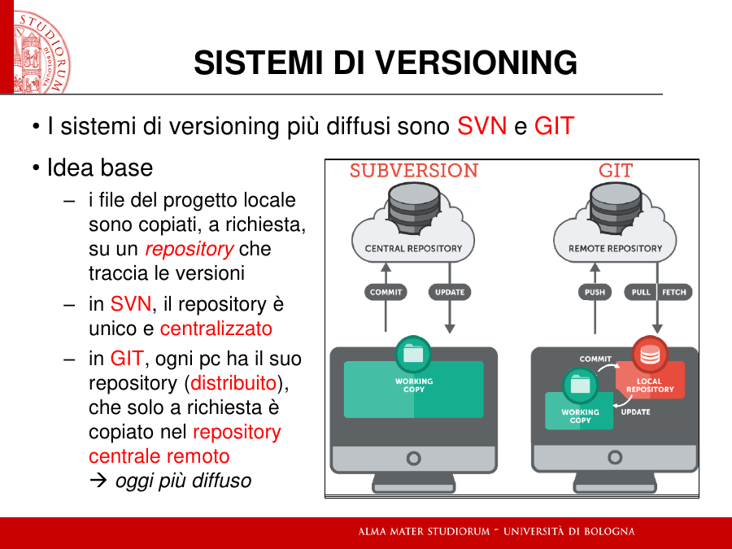
*[fonte: 01, sl. 7]*

L'immagine mostra cosa cambia in pratica. In SVN il `COMMIT` va direttamente al repository
centrale. In Git il `COMMIT` va al **local repository** sulla tua macchina, e solo il `PUSH` lo
porta al remote repository: sono due gesti. È la distinzione che hai incontrato stamattina, quando
il lavoro sembrava salvato ma su GitHub non c'era nulla.

---

## 3. Il collaudo

### 3.1 Perché si progetta prima

Il collaudo «non si improvvisa: va accuratamente progettato — non dopo: prima ancora di costruire
il sistema». È «parte integrante del TUO lavoro» ed è espresso da un **piano di collaudo** che
«guida la validazione del sistema» [fonte: 01, sl. 13]. Non è «fare qualche stampa»: le slide
JUnit spiegano cosa manca alle stampe e perfino all'istruzione `assert` di Java. Una `assert` che
fallisce fa abortire il programma, quindi i test successivi non girano. In più non spiega perché
sia fallita, dato che il suo argomento è solo un boolean, e sta dentro il codice di business logic,
«che quindi si sporca» [fonte: S02, sl. 2 e 7].

### 3.2 Black-box e white-box: cosa li distingue davvero

Le due definizioni del docente [fonte: 01, sl. 14]:

- **black-box testing**: «collaudo progettato e svolto "ai morsetti" di un componente software,
  senza sapere com'è fatto dentro»; scopo, «verificare la correttezza del comportamento esterno,
  indipendentemente dalla realizzazione»;
- **white-box testing**: «collaudo progettato e svolto tenendo esplicitamente in conto com'è fatto
  dentro un componente»; scopo, «verificare la corretta implementazione delle varie funzioni,
  stressandole una ad una anche nei casi critici».

La parola chiave è **«progettato»**. Le due tecniche non si distinguono per il test in sé, ma per
**da dove nasce il caso di test**.

L'immagine dei *morsetti* viene dall'elettrotecnica: di un componente vedi solo i terminali, cioè
cosa entra e cosa esce. Nel software i morsetti sono i metodi pubblici. Un test black-box si scrive
leggendo **la specifica**, cioè cosa il componente *deve* fare, e resta valido per *qualunque*
realizzazione che la rispetti. È questo che significa «indipendentemente dalla realizzazione»: se
riscrivi da capo l'interno del componente, il test non cambia.

Un test white-box si scrive leggendo **il codice**. Vedi che dentro c'è un `if` per un caso
particolare, e progetti un test che costringa l'esecuzione a passare proprio da quel ramo. Serve a
verificare che *quella* implementazione funzioni in ogni suo pezzo, «anche nei casi critici».
Se riscrivi l'interno, i test white-box vanno ripensati, perché i rami che stressavano possono non
esistere più.

Un esempio su un compito d'esame vero, la prova del 9/1/2020 (MiniRail). Il testo stabilisce che
«il bordo sinistro assume la progressiva km 0.0 (inclusa), il bordo destro quella pari alla
lunghezza massima del tracciato (esclusa)», e che «i treni che escono dal bordo destro si
considerano rientrati dal bordo sinistro» [fonte: prova 2020-01-09, testo].

- *Black-box*: dalla sola specifica ricavo un caso da testare, cioè un treno che supera il bordo
  destro deve ricomparire vicino a km 0. Non so come l'hai implementato e non mi interessa.
- *White-box*: guardo il **tuo** codice e trovo che il rientro l'hai gestito con un `if` che
  sottrae la lunghezza del tracciato. Progetto allora un test che porti la posizione *esattamente*
  sul valore della lunghezza, per stressare quel confronto (`>` o `>=`?), che è il punto dove
  quella realizzazione può rompersi.

I due test possono perfino coincidere. Ciò che li separa è il ragionamento che li ha prodotti.

Nel compito d'esame i test forniti dal docente, cioè le classi `*Test.java` dello start kit
(§8.2), sono **black-box rispetto al tuo codice**: il docente li ha scritti sulla specifica del
testo, prima di vedere la tua implementazione, e devono funzionare con qualunque soluzione
corretta.

> ⚠️ **Distinzione da tenere separata** (`profilo/errori.md`, trasversale n. 1). Il caso limite che
> separa le due tecniche: se cambi completamente l'implementazione lasciando identico il
> comportamento esterno, i test black-box restano validi, mentre quelli white-box possono diventare
> insensati.

Le slide JUnit offrono un caso concreto dello stesso confine, anche se non usano questi due nomi,
quindi l'accostamento è mio. Per collaudare il costruttore di `Counter` si costruisce l'oggetto e
se ne verifica il valore **tramite l'accessor pubblico** `getValue`. Le slide notano che così il
test dipende dall'accessor, «possibile vulnus (se l'accessor "mentisse"…?)». L'alternativa, cioè
dare al campo visibilità di package e leggerlo direttamente dal test, entra dentro il componente
«ma al prezzo di mettere il test nello stesso package! → rimedio peggiore del male»
[fonte: S02, sl. 13].

### 3.3 JUnit: failure ed error, e cosa succede se il codice non compila

JUnit è «un framework di test scritto esso stesso in Java»: una serie di classi fa il lavoro
ripetitivo, cioè fa girare i test in batch, conta e riporta i test falliti. Serve allo *unit
testing*, la verifica di «piccole porzioni (unità) di codice (un metodo, una classe, max un
componente)» [fonte: S02, sl. 3]. Il **Test Runner** esegue tutti i metodi di test «senza abortire
se uno o più test falliscono o "esplodono"» [fonte: S02, sl. 6]. È esattamente ciò che l'`assert`
da sola non fa.

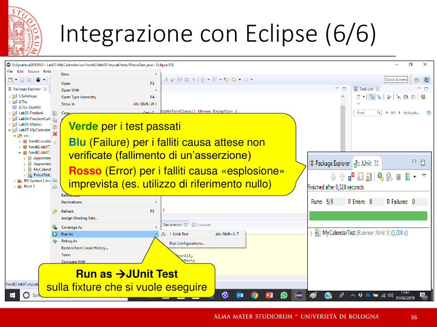
*[fonte: S02, sl. 36]*

I due esiti negativi nelle parole delle slide:

- **Failure** (blu): test fallito «causa attese non verificate (fallimento di un'asserzione)»;
- **Error** (rosso): test fallito «causa "esplosione" imprevista (es. utilizzo di riferimento
  nullo)» [fonte: S02, sl. 36]; nella versione di Denti, «some other exception occurs, one you
  haven't tested for and didn't expect» [fonte: 01, sl. 18].

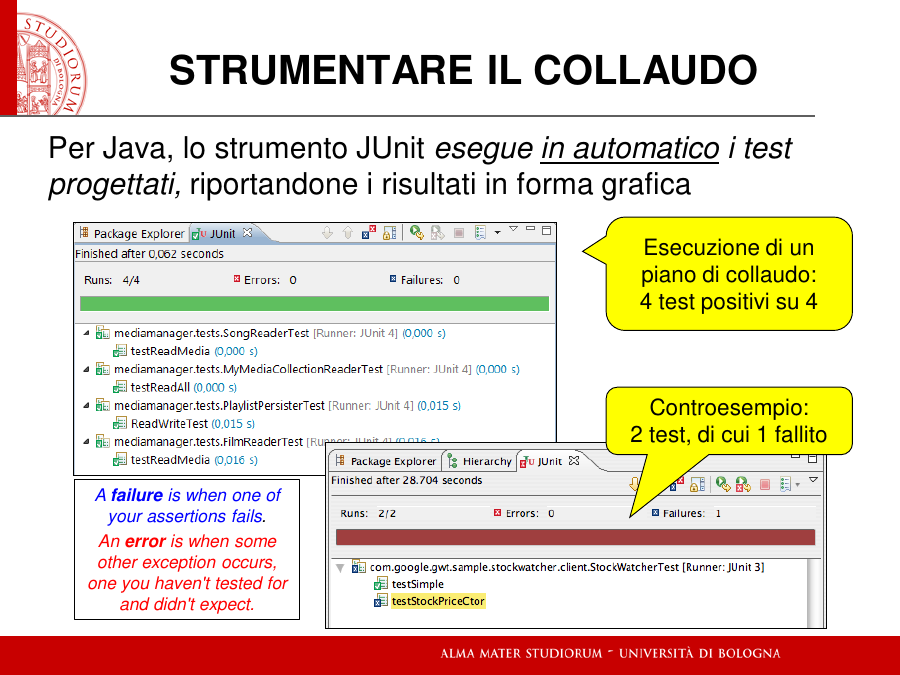
*[fonte: 01, sl. 18]*

Un error è quindi **un'eccezione che scatta mentre il codice gira**. L'esempio del docente,
l'uso di un riferimento nullo, è un errore *logico*: il codice era scritto correttamente, ma in
un caso non previsto ha provato a usare qualcosa che non c'era. Un errore di **sintassi** non
arriva mai fino a JUnit: il codice non compila, quindi non esistono file `.class` da eseguire e i
test non partono proprio. Il compito d'esame lo mette per iscritto: «compiti non compilabili [...]
NON SARANNO CORRETTI e causeranno la verbalizzazione del giudizio "RESPINTO"»
[fonte: prova 2020-01-09, testo]. Le condizioni di superamento sono due, **in sequenza**: prima
compilare, poi superare almeno 2/3 dei test (`fonti.md`).

Il collegamento con la fase di compilazione sta nelle slide 02: uno degli obiettivi dei linguaggi
moderni è «intercettare a compile-time quanti più errori possibile: "se si compila, molto
probabilmente è ok"» [fonte: 02, sl. 10]. Un esempio di errore che il compilatore Java blocca è
`float f = 3.54;`, che produce «ERRORE DI COMPILAZIONE — Possible loss of precision»
[fonte: 02, compatibilità fra reali]. Quel codice non arriva mai all'esecuzione, e quindi mai a
JUnit.

> ⚠️ **Da correggere — domanda 2 dell'autoverifica. Errore nuovo per FI2: compilazione ed
> esecuzione fuse.**
> *Versione data*: «error, se l'esecuzione si blocca per colpa di un fatal error, in questo caso il
> problema è spesso sintattico, legato alla scrittura formale del codice».
> *Analisi*: la classificazione failure/error era giusta; la causa attribuita all'error no. Un
> problema sintattico si ferma **prima**, in compilazione, e non produce alcun esito JUnit. Un
> error nasce **durante** l'esecuzione ed è spesso anch'esso logico: un caso non previsto, come un
> riferimento nullo. Parte dell'ambiguità veniva dalla lezione, che diceva «il codice si rompe
> prima» senza specificare *prima di cosa*: è stata corretta.
> *Versione corretta*: **non compila** → nessun test gira (all'esame: compito non corretto).
> **Compila, il test arriva all'asserzione e il confronto non torna** → failure. **Compila, ma
> durante il test scatta un'eccezione imprevista** → error.

---

## 4. Strumentare il processo: build tools e Maven

### 4.1 Cosa dice il corso

Il corso dedica ai build tools una sola slide: «esistono strumenti che gestiscono / automatizzano
il ciclo di sviluppo: i cosiddetti Build tools. Esempi: Gradle, Maven, … in Gradle si specifica,
con un apposito linguaggio, il grafo delle dipendenze fra più progetti + il relativo ciclo di
sviluppo» [fonte: 01, sl. 17]. Per capire cosa vuol dire, conviene partire da ciò che il corso
insegna a fare **a mano**, perché un build tool automatizza esattamente quello.

### 4.2 Il problema: il ciclo manuale del modulo 03

Le slide 03 costruiscono un'applicazione `Prog` che usa una libreria `CFLib` [fonte: 03, esempio
completo]. I passi sono tutti manuali:

```bash
javac CodFisc.java                    # 1. compila la libreria
jar cf CFLib.jar CodFisc.class        # 2. la impacchetta in un JAR
javac -cp CFLib.jar Prog.java         # 3. compila l'app, dicendo al compilatore dove sta la libreria
jar cmf info.txt Prog.jar Prog.class  # 4. impacchetta l'app (info.txt: Main-Class e Class-Path)
java -cp CFLib.jar;. Prog             # 5. esegue, dicendo alla JVM dove sta la libreria
```

Se al punto 5 la libreria manca, l'esecuzione si interrompe con
`java.lang.NoClassDefFoundError: CodFisc` [fonte: 03]. Tieni presente che anche questo è un
errore a run-time, non di compilazione: al punto 3 la libreria c'era.

Su due classi il ciclo è gestibile. Ora immagina decine di librerie, ciascuna con le proprie
dipendenze, le versioni da tenere allineate, i test da rilanciare a ogni modifica come chiede la
Continuous Integration (lezione, §3), e più persone che devono ottenere lo stesso risultato
sulla propria macchina. È la scalabilità del §1 applicata alla costruzione del software. L'articolo
su Google allegato dal docente mostra la risposta a quella scala: tutto il codice «builds with a
customized version of the Bazel build system», con build **ermetiche**, dove «all inputs must be
explicitly declared and stored in source control». E poiché tutti usano lo stesso build system,
questo diventa «the source of truth for whether any given piece of code compiles without errors»
[fonte: CACM 2018(4), sezione «Build system»].

### 4.3 Maven

`[fonte: maven.apache.org — documentazione ufficiale, fonte esterna al corso]`

Maven è «a tool that can now be used for building and managing any Java-based project». Il suo
obiettivo primario è permettere a uno sviluppatore di organizzare e costruire un progetto Java nel
minor tempo possibile, «shielding developers from many details». Nasce da un problema concreto:
nel progetto Jakarta Turbine c'erano più sottoprogetti, «each with their own Ant build files, that
were all slightly different», e i JAR delle librerie venivano salvati nel controllo di versione. È
lo stesso scenario delle «comunità incomunicabili» che Denti descrive per le librerie (lezione, §6),
spostato sul processo di build.

Tre idee lo reggono.

**Il POM, cioè il progetto descritto in un file.** Invece di una sequenza di comandi, il progetto
si descrive in un file XML, `pom.xml` (*Project Object Model*): «the fundamental unit of work in
Maven». Contiene le informazioni sul progetto, le **dipendenze**, i plugin e la configurazione. Il
POM minimo:

```xml
<project xmlns="http://maven.apache.org/POM/4.0.0">
  <modelVersion>4.0.0</modelVersion>
  <groupId>com.mycompany.app</groupId>
  <artifactId>my-app</artifactId>
  <version>1</version>
</project>
```

`groupId`, `artifactId` e `version` formano il nome completo dell'artefatto
(`com.mycompany.app:my-app:1`); se non si dice altro, il pacchetto prodotto è un **jar**. Il POM
eredita dalla *Super POM* una struttura di cartelle standard: i sorgenti in `src/main/java`, i test
in `src/test/java` e i prodotti in `target`. Per questo, «once you familiarize yourself with one
Maven project, you know how all Maven projects build». Se nel corso in cui l'hai usato il progetto
aveva queste cartelle e un `pom.xml`, erano queste le convenzioni.

**Le dipendenze scaricate, non copiate.** Nel POM si *dichiara* di quali librerie il progetto ha
bisogno, e Maven le scarica da un repository centrale (`https://repo.maven.apache.org/maven2`). In
più risolve le **dipendenze transitive**: se la tua libreria A usa la libreria B, B arriva da sola,
perché Maven «avoids the need to discover and specify the libraries that your own dependencies
require». È l'automazione dei punti 3 e 5 del ciclo manuale, cioè dei `-cp`. Ogni dipendenza ha
uno **scope**: con `test`, per esempio, una libreria è disponibile solo per compilare ed eseguire i
test e non finisce nel prodotto. È il caso tipico di JUnit.

**Il ciclo di vita a fasi.** Il processo di build è «clearly defined» come una sequenza di fasi.
Quelle principali del ciclo *default*:

| Fase | Cosa fa |
|---|---|
| `validate` | verifica che il progetto sia corretto e completo |
| `compile` | compila i sorgenti |
| `test` | esegue i test con un framework di unit testing, senza bisogno di impacchettare |
| `package` | impacchetta il codice compilato nel formato distribuibile, per esempio un JAR |
| `verify` | controlla i risultati dei test di integrazione |
| `install` | installa il pacchetto nel repository **locale**, usabile da altri tuoi progetti |
| `deploy` | copia il pacchetto nel repository **remoto**, per altri sviluppatori |

Le fasi sono **sequenziali**: lanciarne una esegue anche tutte le precedenti. `mvn package`
quindi valida, compila, **esegue i test** e solo alla fine impacchetta, e se un test fallisce il
JAR non viene prodotto. È la Continuous Integration della sl. 15 del docente trasformata in un
comando: nessuna modifica arriva a pacchetto senza passare dai test.

Riassunto del rapporto fra le due scale: i comandi `javac`, `jar` e `java -cp` del modulo 03 sono
ciò che Maven esegue per te, nell'ordine giusto, con le librerie giuste, a partire da una
descrizione dichiarativa del progetto.

> **Nota sul corso.** FI2 non usa Maven: gli start kit d'esame sono **progetti Eclipse** (file
> `.project` e `.classpath`, §8.2), e le librerie come JUnit si configurano nel *Java Build Path*
> del progetto [fonte: S01, proprietà del progetto; 08]. All'esame non ti servirà, ma è la risposta
> industriale allo stesso problema.

---

## 5. Collaudo contro progetto

Le slide 28–30 non sono altri esempi di bug: il titolo è *collaudo vs progetto*, e l'errore
nasce dalle «assunzioni di base non rispettate» [fonte: 01, sl. 28]. Nel pianificatore del 2016,
per andare da Aldini a Carducci sul bus 33 veniva suggerito di scendere a Porta S. Mamolo e
aspettare il bus successivo. Chi aveva scritto il software aveva ipotizzato «che tutte le linee
abbiano due capilinea». La linea circolare, che viola l'assunzione, era stata modellata come due
tronconi, e il software, «tarato (giustamente) sull'assunzione di base, vede un itinerario
composto» [fonte: 01, sl. 29]. L'altro caso, i passeggeri minorenni non previsti dalla compagnia
aerea, porta l'etichetta del docente: **«Dominio del problema mal analizzato»** [fonte: 01, sl. 28].

La chiave è quel «giustamente». Il software faceva ciò per cui era stato progettato. Un piano di
collaudo, anche molto accurato, si progetta a partire dalla specifica (§3.1), e la specifica
conteneva l'assunzione sbagliata. Ogni test scritto su quel modello avrebbe dato verde.

Un collaudo avrebbe potuto far emergere il **sintomo** solo se qualcuno avesse scritto un caso a
partire dalla **realtà** e non dal modello, cioè un viaggio vero sul 33. Ma quel test avrebbe
rivelato che il modello era sbagliato, non che l'implementazione lo era. Il rimedio resta a
monte: rifare l'analisi del dominio e correggere il progetto, e solo dopo codice e test.

> ⚠️ **Da correggere — domanda 3 dell'autoverifica. Errore ricorrente, trasversale n. 1: due
> concetti vicini fusi in uno.** Stesso pattern emerso ripetutamente in Diritto; ora compare su
> FI2. Vedi `profilo/errori.md`.
> *Versione data*: «sì, un collaudo più "estremo" avrebbe potuto notare la dimenticanza [...] il
> collaudo esiste apposta per far emergere problemi legati all'uso pratico».
> *Analisi*: la risposta usa il caso che il docente ha scelto *per separare* collaudo e progetto
> come prova che il collaudo basta. Il collaudo verifica l'implementazione **rispetto al
> progetto**; non verifica il progetto **rispetto alla realtà**. Un test più «estremo» scritto
> sulla stessa assunzione non trova nulla. Il pezzo giusto c'era («se ne sarebbero potuti
> accorgere già in questa fase»), ma è stato riassorbito nel collaudo.
> *Versione corretta*: no, non avrebbe aiutato un collaudo più accurato: il software rispettava il
> progetto. L'errore era nel modello del dominio, e il rimedio è l'analisi.
> *Contromisura* (dal profilo): davanti a due concetti vicini, trovare il caso limite che li separa.
> Qui il caso limite è il 33 stesso: **tutti i test verdi, risultato assurdo**.

---

## 6. Il progetto non è il codice — com'è fatto un diagramma UML

«Il progetto di un sistema software non è il codice — esattamente come il progetto di una casa
non è la casa» [fonte: 01, sl. 68]. L'attività di progetto «dev'essere precedente e totalmente
disaccoppiata dall'implementazione», perché «non si gestisce la complessità senza poter operare a
un adeguato livello di astrazione — che non è il codice» [fonte: 01, sl. 70]. Lo strumento è
**UML** (Unified Modelling Language), «uno standard internazionale per esprimere modelli di
sistemi (non necessariamente informatici)». Fra i suoi diagrammi, il **diagramma di struttura**
«esprime la struttura di un sistema a oggetti» [fonte: 01, sl. 71]. È questo che ti arriva nel
testo del compito.

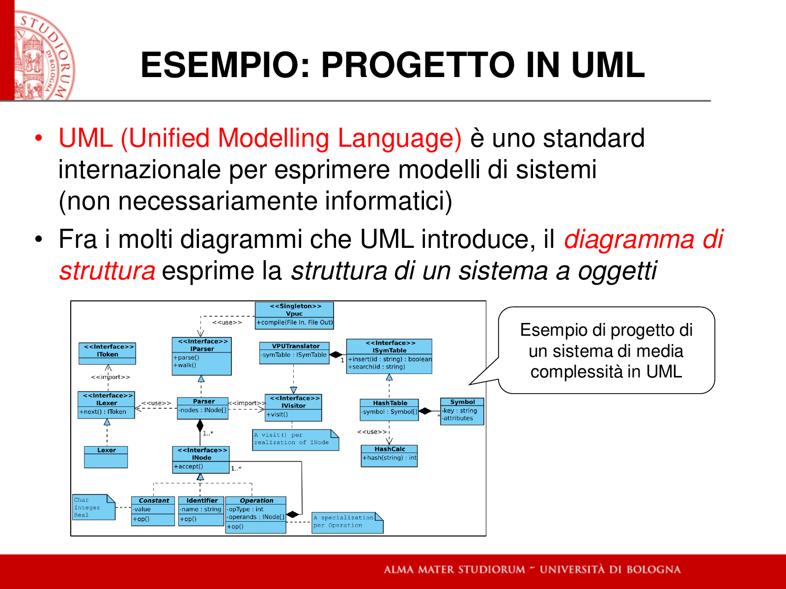
*[fonte: 01, sl. 71]*

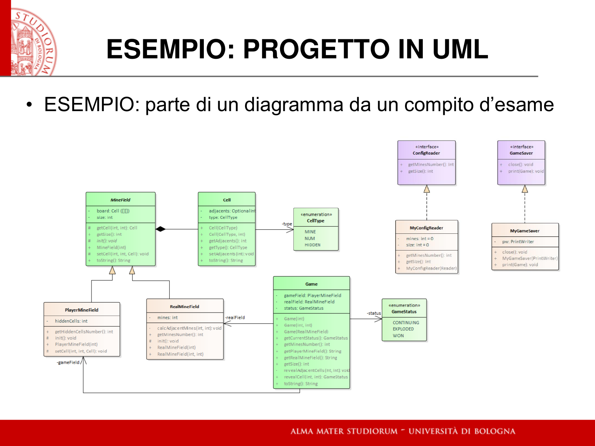
*[fonte: 01, sl. 72]*

Per leggere questi diagrammi servono pochi elementi, e le slide UML del corso li definiscono.

**La classe.** Un rettangolo diviso in comparti: in alto il **nome** (con eventuali
«stereotipi»), poi gli **attributi**, poi le **operazioni**. «Tutti i comparti, a parte quello per
il nome, possono essere non mostrati» [fonte: UML, sl. 10].

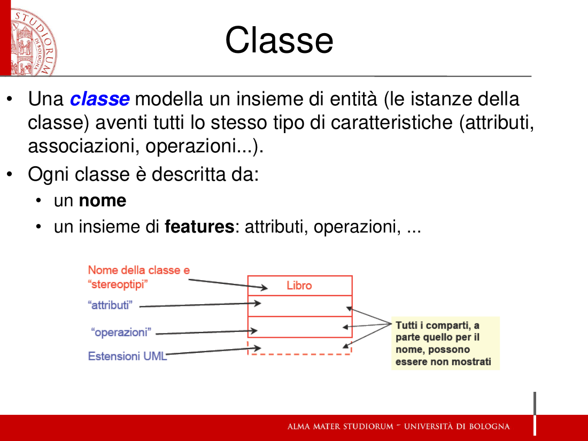
*[fonte: DiagrammiUML, sl. 10]*

Un attributo si scrive `visibilità nome : tipo molteplicità = default {proprietà}`. Per esempio
`stringa: String [10] = "Pippo" {readOnly}`, dove solo il nome è obbligatorio [fonte: UML, sl. 11].
Un'operazione si scrive `visibilità nome (lista parametri) : tipo ritorno`, e in genere corrisponde
a un metodo della classe Java [fonte: UML, sl. 14]. I simboli di visibilità sono `+` public,
`-` private, `~` package, `#` protected [fonte: UML, sl. 13]. Un membro **statico**, che si applica
alla classe e non alle istanze come i `static` di Java, si scrive **sottolineato**
[fonte: UML, sl. 15]. Un nome in *corsivo* indica una classe o un'operazione **astratta**, cioè non
istanziabile direttamente [fonte: UML, sl. 27]. La **molteplicità** dice quanti oggetti partecipano
a una proprietà: `1`, `0..1`, `*`, oppure un intervallo come `2..4` [fonte: UML, sl. 12].

**Le relazioni**, dove le slide avvertono: «UML è un linguaggio (anche se grafico) e scambiare una
freccia per un'altra è un errore non da poco» [fonte: UML, sl. 26].

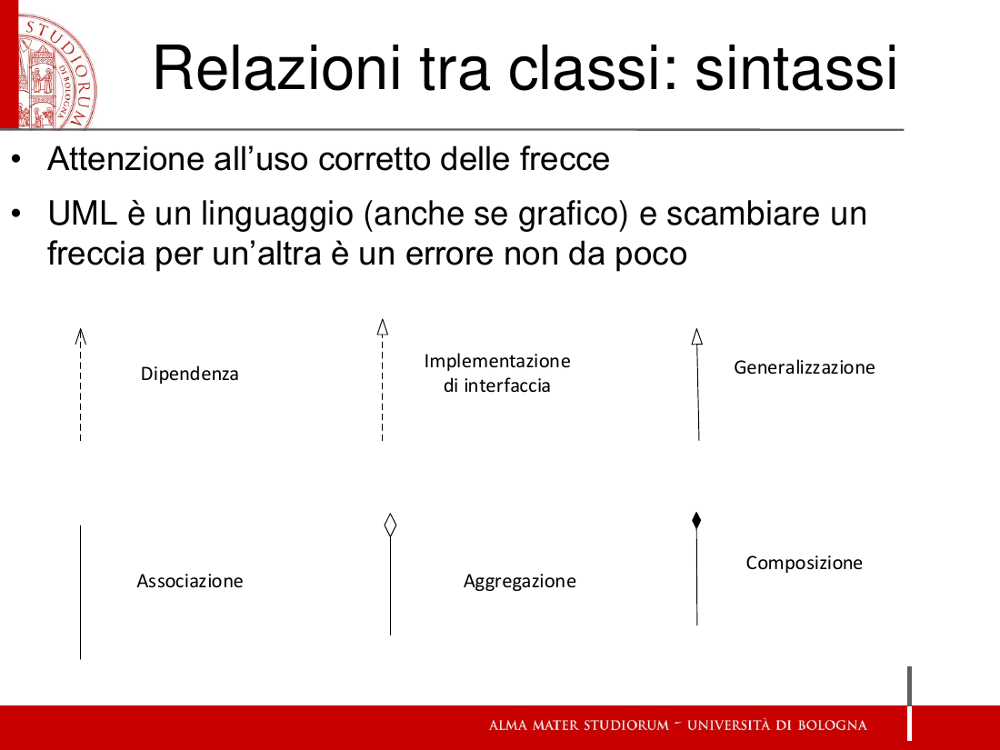
*[fonte: DiagrammiUML, sl. 26]*

- **Associazione** (linea continua): una proprietà espressa come collegamento anziché come
  attributo; «attributi e associazioni sono la stessa cosa» con due notazioni diverse
  [fonte: UML, sl. 7 e 16].
- **Aggregazione** (diamante vuoto, dal lato dell'«intero»): relazione intero-parte, *part-of*.
- **Composizione** (diamante pieno): un'aggregazione con due vincoli in più, cioè una parte sta in
  al massimo un intero per volta, e solo l'intero crea e distrugge le sue parti
  [fonte: UML, sl. 20].
- **Generalizzazione** (linea continua con triangolo vuoto verso la superclasse): «ogni istanza
  della sottoclasse è anche istanza della superclasse». È l'ereditarietà del modulo 13
  [fonte: UML, sl. 22].
- **Implementazione di interfaccia** (tratteggio con triangolo vuoto): la classe fornisce la
  «vista pubblica» richiesta dall'interfaccia, marcata «interface» [fonte: UML, sl. 3–4].
- **Dipendenza** (tratteggio con freccia aperta): compare nella tavola della sl. 26, ma le
  slide lette non ne danno una definizione.

> ⚠️ **Distinzione da tenere separata** (trasversale n. 1): generalizzazione e implementazione di
> interfaccia hanno la **stessa punta** (triangolo vuoto) e differiscono solo per la linea,
> continua o tratteggiata. Ciò che le separa è cosa si riceve. Un'interfaccia «non deve
> specificare come possa essere implementata, ma semplicemente quello che è necessario per poterla
> realizzare», quindi chi la implementa scrive tutto [fonte: UML, sl. 3]. Una superclasse invece
> passa alle sottoclassi le sue caratteristiche, che queste possono estendere o sovrascrivere
> (*overriding*) [fonte: UML, sl. 25].

**Le enumerazioni**, infine, sono classi marcate «enumeration» con un insieme di valori prefissati
[fonte: UML, sl. 29]. Nel diagramma della sl. 72 ne vedi due: `CellType` e `GameStatus`.

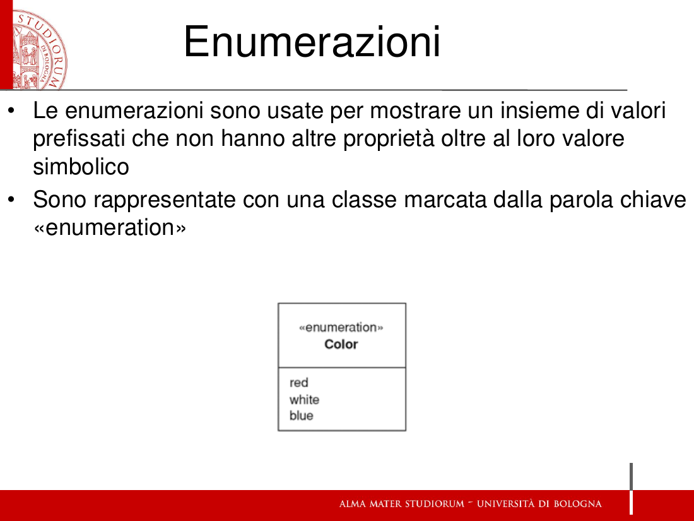
*[fonte: DiagrammiUML, sl. 29]*

Ora rileggi la sl. 72 (un campo minato) con questi elementi. Ogni simbolo ha una conseguenza sul
codice che scriverai:

- **`MineField` ha il nome in corsivo**, quindi è una classe **astratta**, e anche la sua
  operazione `init(): void` è in corsivo, quindi astratta. `PlayerMineField` e `RealMineField` vi
  puntano con **linea continua e triangolo vuoto**: sono **generalizzazioni**, cioè sottoclassi di
  `MineField`. Entrambe hanno una propria `init()`, che realizza quella astratta.
- **Il diamante pieno** fra `MineField` e `Cell` è una **composizione**: il campo è fatto di celle,
  e l'attributo `board: Cell[][]` di `MineField` ne è la versione come attributo. Sono le due
  notazioni della stessa proprietà (sl. 7).
- **`MyConfigReader` e `MyGameSaver`** puntano a `«interface» ConfigReader` e
  `«interface» GameSaver` con **tratteggio e triangolo vuoto**: **implementano** quelle
  interfacce, e infatti ripetono le stesse operazioni (`getMinesNumber()`, `getSize()`;
  `close()`, `print(Game)`).
- **`«enumeration» CellType`** (MINE, NUM, HIDDEN) e **`«enumeration» GameStatus`** (CONTINUING,
  EXPLODED, WON) sono i valori prefissati.
- Le **associazioni** con freccia aperta portano il nome del ruolo: `-type` da `Cell` a `CellType`,
  `-status`, `-realField` e `-gameField` da `Game`. Il `-` davanti è la visibilità: sono campi
  privati. Il ruolo è il nome del campo che scriverai.
- Nei comparti, `+`, `-` e `#` dicono se ogni membro è pubblico, privato o protected. `getCell` e
  `setCell` di `MineField`, per esempio, sono `#`, cioè visibili alle sottoclassi.

Leggere il diagramma prima di scrivere codice è il lavoro di progetto del §5, già fatto dal
docente: all'esame lo traduci in classi Java.

---

## 7. Le idee dal mondo funzionale — cosa sono e che forma hanno in Java

La slide 53 elenca le idee «from the functional programming world» che i linguaggi moderni
reinnestano [fonte: 01, sl. 53]. Qui ciascuna ha il suo significato, la sua forma in Java e il
modulo in cui il corso la sviluppa. Una premessa: Java è il più «conservativo» dei quattro
linguaggi del corso. Molte di queste idee le ha in forma parziale, e le slide lo dicono di volta
in volta. Non dare per scontato che una parola significhi in Java ciò che significa in Scala o
Kotlin.

### 7.1 Variabili e valori (`var` / `val`)

Una **variabile** è un nome il cui contenuto può essere riassegnato. Un **valore** è un nome
legato una volta per tutte. In Scala e Kotlin la distinzione è nella sintassi: le variabili si
introducono con `var`, e con `val` «se immodificabili», con il tipo scritto dopo il nome
[fonte: 02, il caso più semplice]:

```kotlin
var x: Int = 3      // variabile: si può riassegnare
val y: Int = 4      // valore: riassegnarlo è un errore di compilazione
```

In Java la parola `val` non esiste. L'effetto di «nome non riassegnabile» si ottiene con
**`final`**: «una costante si definisce qualificando `final` una variabile pre-inizializzata», e
«ogni tentativo di riassegnare la costante a un diverso valore sarà stroncato dal compilatore»
[fonte: 07, costanti]:

```java
final int DIM = 8;   // DEVE essere inizializzata: altrimenti errore di compilazione
DIM = 8;             // NO! errore di compilazione, anche se il valore è identico
```

> ⚠️ **Trappola di terminologia** (trasversale n. 1). Anche Java ha una parola `var`, ma **non**
> è la `var` di Scala e Kotlin. In Java `var` chiede al compilatore di **dedurre il tipo**
> (*type inference*): `var p1 = new Persona("John", 25);` dichiara `p1` di tipo `Persona` senza
> scriverlo [fonte: 17, record esempio 1; 32, «anche nella forma con type inference»]. Non dice
> nulla sulla modificabilità. Il caso limite che le separa: `var` in Kotlin è l'opposto di `val`;
> `var` in Java si può combinare con `final` perché risponde a un'altra domanda.

### 7.2 Via i tipi primitivi: «everything is an object»

Un **tipo primitivo** è un valore nudo, come in C: un `int` è 4 byte, non un oggetto, e non gli si
può chiedere nulla. Un **oggetto** è un'entità a cui si mandano messaggi con la notazione puntata,
`comp.operation(argomenti)` [fonte: 02, sl. 5–6].

Java **mantiene** i tipi primitivi del C, «pur estendendoli e ridefinendoli», per ragioni storiche
e di prestazioni, «MA l'esperienza ha dimostrato che non è stata una grande idea!». C#, Scala e
Kotlin li sostituiscono con tipi di oggetti, con l'obiettivo di «uniformità & drastica
semplificazione» [fonte: 02, tipi primitivi sì o no]. I tipi primitivi di Java
[fonte: 02, tipi base]:

| Categoria | Tipi Java (primitivi) | In Scala/Kotlin (oggetti) |
|---|---|---|
| logico | `boolean`: solo `true`/`false`, **non** sono 0 e 1, niente cast da/verso interi | `Boolean` |
| interi | `byte` (1 byte) · `short` (2) · `int` (4) · `long` (8; costanti con `L`) | `Byte` `Short` `Int` `Long` |
| reali IEEE-754 | `float` (4; costanti con `F`) · `double` (8) | `Float` `Double` |
| carattere | `char`: 2 byte, UTF-16 | `Char` |

Il prezzo della scelta di Java si vede quando serve un oggetto. Una collection non accetta
`List<int>`: si deve scrivere `List<Integer>` [fonte: 16]. Per questo esistono le **classi
wrapper** (`Integer`, `Double`, …), che incapsulano un primitivo in un oggetto. Le operazioni
hanno un nome: il **boxing** mette il valore nel wrapper, l'**unboxing** lo estrae [fonte: 16]:

```java
Integer i = Integer.valueOf(22);   // boxing esplicito (da Java 9 il costruttore è deprecato)
int x = i.intValue();              // unboxing esplicito
Integer k = 7;                     // da Java 5 boxing e unboxing sono automatici
```

Negli altri linguaggi il problema non si pone: «i tipi primitivi sono classi e i relativi valori
sono oggetti», usabili ovunque senza boxing [fonte: 16]. Per esempio, ogni numero ha la sua
`toString` [fonte: 06, everything is an object].

### 7.3 I costrutti come espressioni: «everything is an expression»

Un'**istruzione** (*statement*) *fa* qualcosa e non restituisce nulla. Un'**espressione** *vale*
qualcosa, quindi si può assegnare o restituire. In Scala il `match` e in Kotlin il `when`, entrambi
evoluzioni dello `switch`, sono «un'espressione, non un'istruzione! Quindi, può restituire un
risultato» [fonte: 17]. Kotlin porta l'idea fino alla funzione: se il corpo è una sola espressione,
«si possono evitare sia il blocco {} sia la keyword return: basta un =» [fonte: 17].

Java ci arriva per gradi. «Da Java 13, la switch expression — che può restituire un risultato — si
affianca al tradizionale switch statement (che resta)» [fonte: 17, record esempio 1]:

```java
return switch (this.anni) {
    case 0,1,2,3,4,5,6,7,8,9,10,11,12,13,14,15,16,17 -> this.nome + " è minorenne";
    default -> this.nome + " è un lavoratore";
};
```

Nella forma a espressione `->` sostituisce i due punti, il break è implicito (niente
*fall-through*) e «tutti i casi devono essere coperti (niente buchi!)» [fonte: 17].

### 7.4 Strutture immodificabili: «compute by synthesis»

Una struttura **immodificabile** (*immutable*) non cambia dopo la creazione. Per ottenere un
risultato diverso non si modifica l'originale: se ne **sintetizza uno nuovo**, ed è questo il
senso di *compute by synthesis*. Il caso che userai subito sono le **stringhe** Java: «poiché gli
oggetti stringa sono immodificabili, i singoli caratteri sono selezionabili solo in lettura», e
«tutti i metodi restituiscono sempre nuovi valori, senza mai alterare l'originale» [fonte: 06]:

```java
String s = "Nel mezzo del cammin";
s.charAt(4) = 'Q';            // NO! VIETATO!
String s2 = s.replace('z', 'Z');  // s resta intatta: s2 è una stringa NUOVA
```

Lo stesso vale per la concatenazione: dopo `s1 = s1 + s2`, un altro riferimento che puntava al
vecchio `s1` vede ancora `"ciao"`, perché `s1` ora punta a un oggetto nuovo [fonte: 06,
concatenazione]. Per le classi di dati, Java 15+ offre il **record**, che «contiene dati
immutabili: "Records are intended to be simple data carriers"». Il compilatore genera costruttore,
accessor, `equals`, `hashCode` e `toString`, e il record è `final` [fonte: 17]:

```java
public record Persona(String nome, int anni) {}
var p1 = new Persona("John", 25);
System.out.println(p1.nome());   // accessor generato: si chiama come il campo
```

Il perché della preferenza: le strutture immutabili «garantiscono safety» [fonte: 02, requisiti
per nuovi linguaggi], perché nessuno può cambiarti un dato sotto i piedi.

### 7.5 Le funzioni come *first-class entities*: lambda, chiusure, lazy evaluation

Una funzione è **first-class entity** se è «manipolabile come ogni altro tipo di dato»: si può
assegnare a una variabile di tipo «funzione da A a B», passare come argomento a un'altra funzione
e definire come ogni altro oggetto [fonte: 30]. Il vantaggio è poter passare **comportamento**
come si passano i dati: il comparatore a un algoritmo di ordinamento, la reazione a un clic
nella grafica [fonte: 30].

La forma concreta è la **lambda expression**, una funzione anonima scritta sul posto
[fonte: 30]:

```java
(lista argomenti) -> { corpo della funzione }
(int x, int y) -> 2*x - y                 // x,y → 2x−y
IntUnaryOperator f = x -> x + 3;          // con type inference sul tipo di x
```

Qui Java è di nuovo parziale. Le lambda esistono da Java 8, «MA non sono vere first class
entities, perché non definiscono un tipo»: si appoggiano a «opportune interfacce, dette
interfacce funzionali», come `IntUnaryOperator` sopra [fonte: 30]. In Scala e Kotlin il tipo
della funzione fa parte del linguaggio, per esempio `(Int) -> Int` [fonte: 30].

Le altre due voci della sl. 53:

- **chiusure** (*closure*): una lambda può usare variabili dell'ambiente in cui è scritta. In Java
  quelle variabili «devono essere final o effectively final», cioè non modificabili dentro la
  lambda; in Scala e Kotlin invece si possono modificare [fonte: 32].
- **lazy evaluation**: le operazioni non si eseguono subito, «ma solo quando e se servono». In Java
  la trovi negli **Stream**, e permette perfino uno stream infinito, come
  `Stream.iterate(2, n -> n+2)` per tutti i numeri pari, perché gli elementi sono prodotti «solo al
  bisogno» [fonte: 35].

La voce «operatori come funzioni, operatori come metodi» è **solo nominata** nella sl. 53 e non è
sviluppata nelle slide lette per questi appunti. Non la integro da altre fonti.

### 7.6 Stile più conciso

È la conseguenza delle voci precedenti: il record di una riga al posto di una classe con campi,
costruttore, accessor, `equals`, `hashCode` e `toString` scritti a mano [fonte: 17]; la lambda al
posto di una classe che esiste solo per contenere un metodo [fonte: 32, il Comparator come «adulto
accompagnatore»]; `var` al posto di un tipo lungo ripetuto due volte.

**Dove tornano nel corso**: 07 (`final`) · 06 (stringhe immodificabili) · 16 (wrapper e boxing) ·
17 (record e switch expression) · 30 e 32 (lambda e chiusure) · 35 (stream e lazy evaluation).

---

## 8. L'infrastruttura: JVM, JRE, JDK, e cosa c'è nel «kit»

### 8.1 Tre strati uno dentro l'altro

In Java non si produce un eseguibile autocontenuto: il compilatore genera **bytecode**, il formato
intermedio dell'infrastruttura, e a run-time «si caricano e collegano DINAMICAMENTE i componenti
che servono» [fonte: 01, sl. 78].

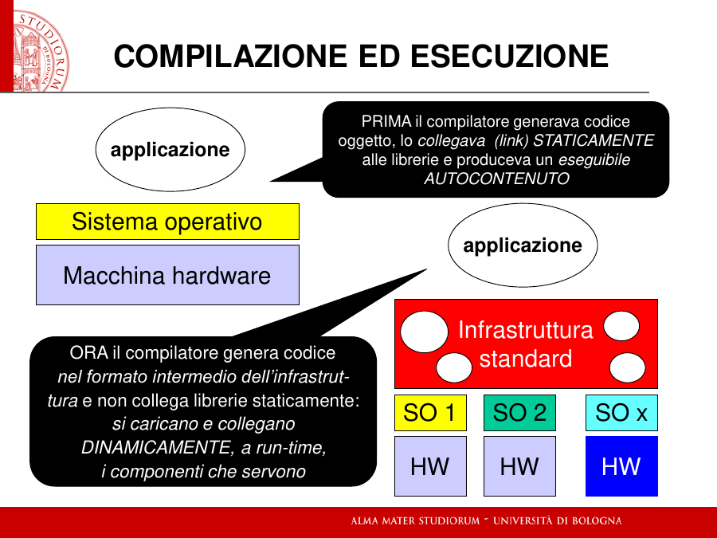
*[fonte: 01, sl. 78]*

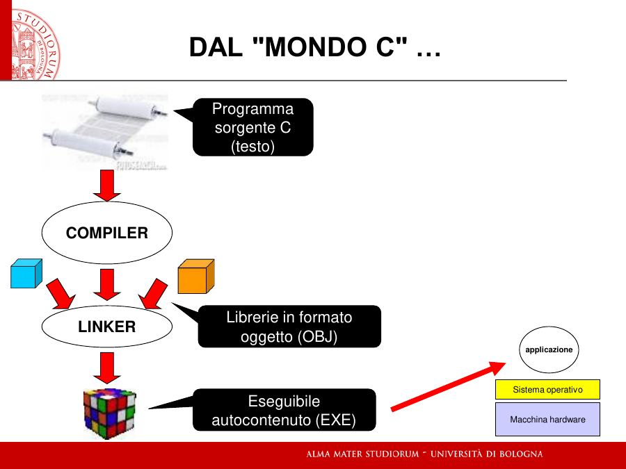
*[fonte: 01, sl. 82]*

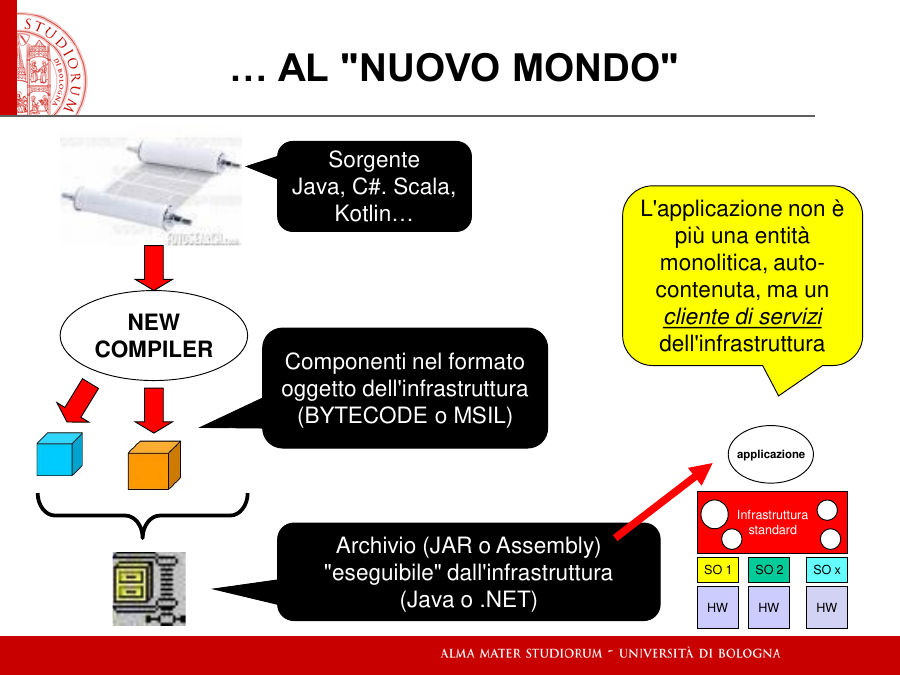
*[fonte: 01, sl. 83]*

Chi fa girare quel bytecode? Un'infrastruttura a tre strati, uno contenuto nell'altro:

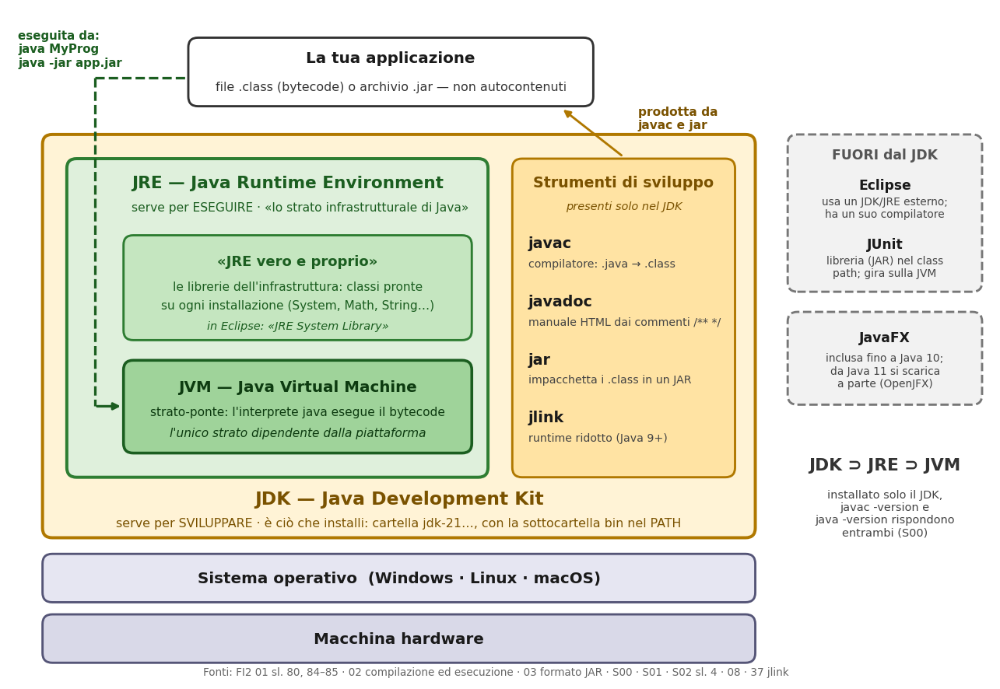
*Schema costruito sulle fonti del corso: 01 sl. 80, 84–85 · 02 · 03 · S00 · S01 · S02 sl. 4 · 08 · 37*

**La JVM, Java Virtual Machine, è lo strato-base.** È la macchina virtuale che «astrae da ciò che
c'è sotto» [fonte: 01, sl. 79]. In pratica è lo **strato-ponte**, l'interprete che si invoca con il
comando `java` e che legge il bytecode adattandolo alla macchina reale: «È l'unico strato
dipendente dalla piattaforma» [fonte: 01, sl. 84; 02, esecuzione sull'infrastruttura]. Esiste una
JVM per Windows, una per Linux, una per macOS, e tutte eseguono lo stesso `.class`. Poiché la JVM
esegue bytecode e non Java, sulla stessa JVM girano anche Scala e Kotlin, che producono file
`.class` e sono interoperabili con Java [fonte: 01, sl. 80; 02].

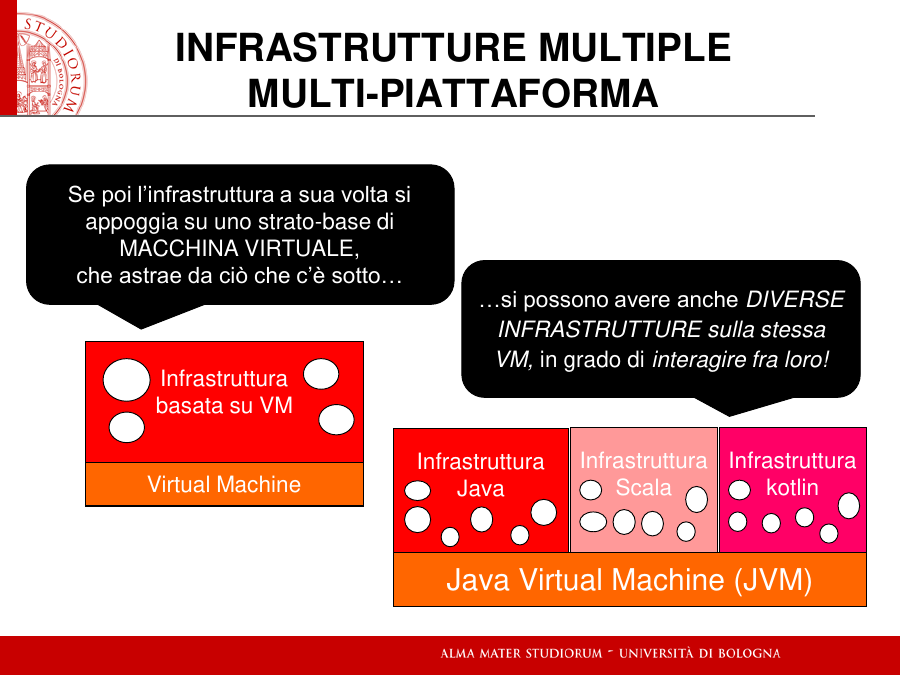
*[fonte: 01, sl. 80]*

**Il JRE, Java Runtime Environment, è ciò che serve per ESEGUIRE.** È «lo strato infrastrutturale di
Java» [fonte: S00, sl. 2] e ha «due livelli: Java Virtual Machine (JVM) + JRE vero e proprio»
[fonte: 01, sl. 85]. Il «JRE vero e proprio» sono le **librerie dell'infrastruttura**, cioè le
classi pronte che trovi su ogni installazione. Quando scrivi `System.out.println(...)` o
`Math.sin(...)` usi «una classe fornita dall'infrastruttura» [fonte: 02, esempio con due entità].
In Eclipse le vedi elencate come «JRE System Library» [fonte: S01, sl. 14]. Una JVM senza queste
librerie saprebbe eseguire bytecode, ma il tuo programma non troverebbe `System` né `Math`.

**Il JDK, Java Development Kit, è ciò che serve per SVILUPPARE.** È «l'insieme di strumenti (in
primis, il compilatore) necessari per SVILUPPARE applicazioni Java» [fonte: S00, sl. 2], «un set di
strumenti più ampio» del JRE [fonte: 01, sl. 85]. Più ampio vuol dire che lo contiene: le slide di
installazione fanno scaricare **solo il JDK**, e subito dopo verificano sia `javac -version`
(compilatore) sia `java -version` (interprete), che devono avere lo stesso numero di versione
[fonte: S00, verifica del path]. Chi ha il JDK ha quindi anche il JRE, e con esso la JVM.

**L'uso effettivo, cioè chi installa cosa.**
- *Tu*, che sviluppi e all'esame compili, installi il **JDK**: OpenJDK, gratuito, distribuito come
  ZIP. La sua sottocartella `bin` va nel PATH, e conviene impostare `JAVA_HOME` [fonte: S00].
- *L'utente finale*, che deve solo usare un'applicazione, ha bisogno del **JRE**: il JAR «non
  sarebbe eseguibile dal sistema operativo stand alone» [fonte: 01, sl. 81].
- Il JRE completo è pesante («215 MB» nell'esempio delle slide). Da Java 9 lo strumento `jlink`
  genera un runtime **ridotto** con solo i moduli che l'applicazione usa (36 MB nello stesso
  esempio), e così l'utente non deve installare nulla [fonte: 37].

**Cosa sta fuori da tutti e tre**, e si confonde spesso con loro:
- **Eclipse** non è Java. È «lo strumento visuale [...] per LAVORARE CONCRETAMENTE in Java»
  [fonte: S00, sl. 2], è esso stesso un'applicazione Java, ha **un proprio compilatore** e non usa
  quello del JDK, ma per far girare le applicazioni «richiede necessariamente un JRE/JDK esterno»
  [fonte: S01, sl. 3];
- **JUnit** non fa parte del JDK: è un framework in Java che gira **sopra** la JVM
  [fonte: S02, sl. 4] e che nei progetti compare come JAR nel *class path* [fonte: 08];
- **JavaFX**, la libreria grafica, era inclusa nel JDK fino a Java 10; da Java 11 si scarica a
  parte da OpenJFX [fonte: S00].

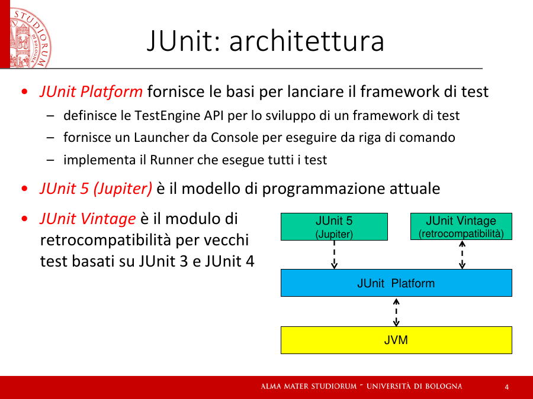
*[fonte: S02, sl. 4]*

> ⚠️ **Distinzione da tenere separata** (trasversale n. 1). Il caso limite che separa JRE e JDK: con
> il **solo JRE** un `.jar` o un `.class` **gira** (`java -jar app.jar`), ma un sorgente `.java`
> **non si compila**, perché `javac` sta solo nel JDK. JVM e JRE sono separati da un altro caso
> limite: la JVM da sola sa eseguire bytecode, ma senza le librerie del JRE non troverebbe
> `System.out`.

### 8.2 Il «kit»: non è lo start kit

Quando la sl. 100 dice che «il kit include anche strumenti per…», **kit** è la K di **JDK**, Java
Development *Kit*: l'insieme degli strumenti di sviluppo che accompagnano il compilatore. La frase
completa è: «A differenza di C e C++, però, qui il compilatore è solo uno degli strumenti»
[fonte: 01, sl. 100]. Lo **start kit** dell'esame è un'altra cosa, ed è descritto in fondo a questa
sezione.

I tre scopi della slide e gli strumenti che li realizzano:

**Produrre documentazione → `javadoc`.** Il docente parte da una constatazione: un buon programma
dovrebbe essere documentato, «ma l'esperienza insegna che quasi mai ciò viene fatto!». Java ne
prende atto e fornisce uno strumento che produce la documentazione «automaticamente a partire da
particolari commenti nel programma» [fonte: 02, la documentazione]. Un commento Javadoc inizia con
`/**` invece di `/*`, può stare in testa a una classe o a un metodo, e accetta tag come `@author`
e `@version`:

```java
/** File Esempio.java
 * Applicazione Java da linea di comando
 * Stampa la classica frase di benvenuto
 * @author Enrico Denti
 * @version 1.0, 02/02/2022
 */
public class Esempio0 { ... }
```

```bash
javadoc -d docs Esempio0.java     # produce nella cartella docs un manuale HTML
```

Il manuale è in HTML, e le frasi che contiene sono quelle estratte dai commenti [fonte: 02].
Eclipse lo genera da menu, a patto di indicargli dove si trova `javadoc.exe`, cioè nella cartella
`bin` del JDK [fonte: S01, sl. 36]. È la ragione per cui la documentazione resta «sempre
aggiornata»: vive nel codice e si rigenera da lì.

**Supportare il collaudo → le «suite di test».** Qui serve una precisazione, perché la sl. 100
parla di Java e C# insieme. Nel caso di Java, lo strumento che il corso usa per l'«esecuzione
automatizzata di suite di test» è **JUnit**, che però **non è dentro il JDK**: è un framework
esterno, scritto in Java, che si aggiunge al progetto come libreria [fonte: S02, sl. 3–4; 08]. Il
JDK di suo offre solo l'istruzione `assert`, con i limiti del §3.1. JUnit funziona così
[fonte: S02, sl. 5–8]:
- i test si scrivono in una classe separata, la **test fixture**, quindi fuori dalla business
  logic;
- un metodo è un test perché è marcato con l'annotazione **`@Test`**, non per il suo nome;
- dentro si usano i metodi statici **`assertXXX`**: `assertEquals(expected, current)`, che sugli
  oggetti usa `equals`; `assertTrue`, `assertNull`, `assertSame`, che confronta i riferimenti con
  `==`; per i reali `assertEquals(expected, current, delta)`;
- il **Runner** li esegue tutti, in ordine volutamente non deterministico, e produce il report
  verde, blu o rosso del §3.3. Per questo ogni test deve essere indipendente dagli altri.

**Progettare la distribuzione → `jar`**, e da Java 9 anche `jlink`. Poiché in Java «non esiste più
l'eseguibile monolitico», un'applicazione di molte classi si distribuisce come **JAR**: un file
ZIP che l'infrastruttura usa senza scompattarlo [fonte: 03, sl. 2]. Al suo interno una cartella
`META-INF` contiene il file `MANIFEST.MF` con le informazioni extra, e per un'applicazione la più
importante è **dove sta il main** [fonte: 03, sl. 4].

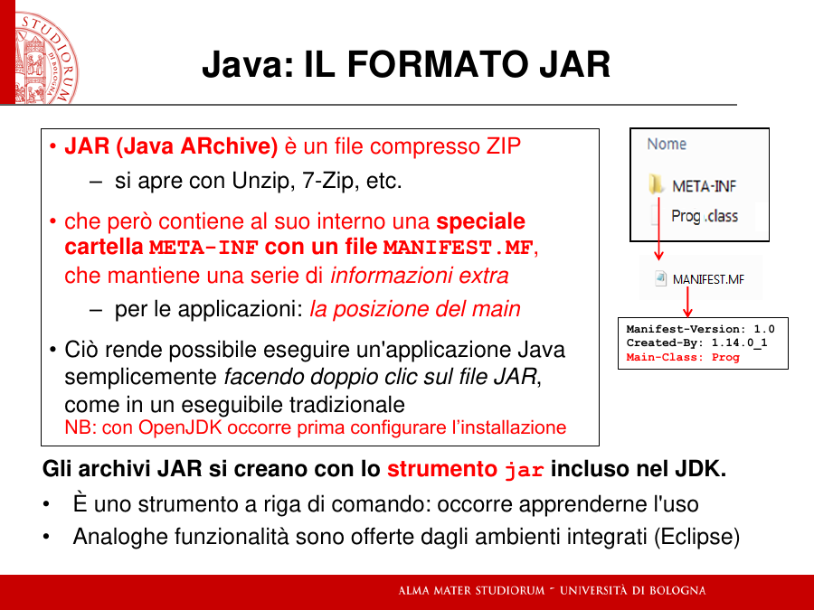
*[fonte: 03, sl. 4]*

```bash
jar cf  libreria.jar  *.class                        # JAR-libreria: senza main
jar cmf info.txt  app.jar  *.class                   # JAR eseguibile: info.txt contiene "Main-Class: NomeClasse" + riga vuota
jar cef NomeClasseMain app.jar *.class               # idem, da Java 9, senza file ausiliario
java -jar app.jar                                    # esecuzione
```

[fonte: 03, sl. 5–8]. Con OpenJDK su Windows, per far partire un JAR con il doppio clic serve
prima lo strumento *jarfix* [fonte: S00]. La sl. 100 cita anche la **firma digitale** del pacchetto
per garantirne l'autenticità, ma le slide lette non nominano lo strumento che la realizza. Per
applicazioni che non devono richiedere nessuna installazione esiste `jlink` (§8.1).

**E lo start kit dell'esame, allora?** È un archivio `…-StartKit.zip` che il docente ti consegna
insieme al testo. Dentro c'è un **progetto Eclipse già impostato**. Per esempio lo start kit del
9/1/2020 contiene [fonte: prova 2020-01-09, StartKit.zip]:
- `.project`, `.classpath`, `.settings/`: la configurazione del progetto per Eclipse;
- `src/…`: i sorgenti, organizzati in package (`model`, `persistence`, `ui/controller`,
  `ui/javafx`, `console`) e in parte già scritti, che tu completi;
- `test/…`: le classi di test JUnit del docente (`GaugeTest.java`, `LineTest.java`, …), cioè i
  test **black-box** del §3.2 su cui si misurano i 2/3;
- file di dati (`config.txt`, `lines.txt`) per la parte di persistenza.

Si consegna uno ZIP con «l'intero progetto Eclipse», e il progetto deve compilare
[fonte: prova 2020-01-09, testo]. Quindi il *kit* della sl. 100 è la cassetta degli attrezzi con
cui lavori, mentre lo *start kit* è il semilavorato su cui lavori all'esame.

> ⚠️ **Da precisare — domanda 5 dell'autoverifica.** L'argomento era buono: «eseguibile» è
> relativo all'ambiente che lo interpreta, e il JAR ha bisogno dell'infrastruttura come l'EXE di
> Windows.
> *Versione data*: le librerie «vengono scaricate e chiamate solo quando effettivamente utili».
> *Analisi*: «scaricate» evoca la rete. Le librerie dell'infrastruttura sono **già installate**
> con il JRE (§8.1) e vengono **caricate e collegate dinamicamente a run-time** [fonte: 01,
> sl. 78]. Chi le scarica davvero dalla rete, al momento della *build*, è Maven (§4.3): proprio per
> questo conviene non usare la stessa parola. Allo stesso modo «hardcodati» ha un nome nel corso:
> **collegamento statico**, fatto dal *linker* [fonte: 01, sl. 82].
> *Versione corretta*: in C il linker collega **staticamente** le librerie e produce un eseguibile
> autocontenuto per un sistema operativo specifico; in Java il compilatore produce **bytecode** e
> le librerie dell'infrastruttura installata si caricano e collegano **dinamicamente** a run-time.

> ✅ Nella risposta 5 hai colto il punto che il docente chiama «la tipica obiezione»: un JAR non è
> meno eseguibile di un EXE, ciò che conta è la presenza dello strato che lo interpreta
> (sl. 94). È il cuore della seconda metà del modulo.

---

## 9. L'automazione e l'AI

Gli strumenti che generano codice, prima dal modello UML e oggi con l'AI, alleggeriscono i compiti
ripetitivi, «MA occhio al risultato: i generatori di testo sono progettati più per produrre testo
gradevole che testo preciso — serve sempre una mente lucida e competente per valutare ciò che viene
prodotto!» [fonte: 01, sl. 34]. All'esame non c'è alcuno strumento che scriva codice: la competenza
per valutarlo si costruisce scrivendolo.

---

## Da rifare a freddo

Il modulo resta 🔶. Rispondi di nuovo, senza riaprire questi appunti, alle domande **2, 3 e 4**
dell'autoverifica in `lezione_01_linguaggi_infrastrutture.md`. Aggiungi due verifiche nate dalle
tue domande: descrivi un caso di test black-box e uno white-box per lo stesso metodo, e spiega cosa
fa `mvn package` e perché può non produrre il JAR.
