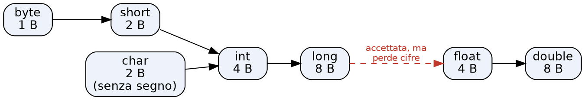

# Prontuario FI2 — da tenere aperto all'esame

> **Cos'è.** Il punto d'ingresso del kit d'esame (`esame_FI2/`). Non spiega: *risponde*, e
> quando la risposta è un pezzo di codice rimanda al **file dove Lorenzo l'ha già scritto**.
>
> **Come si usa in prova.**
> 1. **Errore rosso** in Eclipse o eccezione in console → `Ctrl+F` sul testo del messaggio (§1).
> 2. **Devi fare una cosa** (leggere un file, ordinare, arrotondare) → *Indice per bisogno*.
> 3. ⚠️ segna le righe dove Lorenzo ha già sbagliato almeno una volta: lì rallenta.
>
> **Com'è ordinato.** Per **parte del compito**, come i package dello startkit d'esame
> (`model`, `persistence`, `controller`, `ui`), non per modulo del corso: in prova sai in quale
> classe sei, non da quale slide viene la cosa. `[riorganizzato il 2026-09-30]`
>
> **Come cresce.** A ogni fine sessione pratica (`/chiudi`, passo 8a), solo con ciò che è stato
> **incontrato davvero**; ogni frammento di codice è commentato riga per riga. Le sezioni vuote
> restano visibili: si riempiono coi LAB e con le prove.
>
> **Fonti.** `[02x sl. N]` = pagina del PDF di slide indicato. `[oltre la fonte]` = non è nelle
> slide, verificato in jshell (JDK 21) e, per i messaggi di Eclipse, con il suo compilatore (ecj
> 3.38), il 2026-09-26.

---

## Indice per bisogno

| Devo… | Vai a | Fatto in |
|---|---|---|
| capire un errore «Type mismatch» / «lossy conversion» | 1.1 | 02x |
| capire un'eccezione in console (`/ by zero`, `NumberFormatException`) | 1.2 | 02x |
| capire perché un risultato è sbagliato senza nessun errore | 1.3 | 02x |
| sistemare Eclipse che non compila al primo avvio | 2 | setup 26/09 |
| sapere quanto è grande / fin dove arriva un tipo | 3.1 | 02x |
| sapere se un assegnamento fra numeri compila | 3.2 | 02x |
| capire overflow, `Infinity`, `NaN`; confrontare due `double` | 3.3 | 02x |
| arrotondare a intero | 3.4 | 02x |
| trasformare una stringa in numero, o un numero in stringa | 3.5 | 02x |
| fare conti su caratteri (`'7'` → 7, lettera successiva) | 3.6 | 02x |
| scrivere un `main` e leggere gli argomenti | 3.7 | 02x |
| importare lo startkit, rinominare il progetto | 2 | LAB02 |
| lanciare test fatti di `assert` (`-ea`); capire le X rosse iniziali | 2 · 1.1 | LAB02 |
| scrivere una classe-valore immutabile: costruttori, getter, `equals`, `toString` | 3.8 | LAB02 |
| usare `mcd` / scrivere `mcm` | 3.8 | LAB02 |
| operazioni che restituiscono un oggetto nuovo (`sum`, `sub`, `mul`, `div`, `reciprocal`) | 3.9 | LAB03 |
| capire l'mcm e portare due frazioni allo stesso denominatore | 3.9 | LAB03 |
| scrivere un `compareTo` che restituisce 0 / 1 / −1 | 3.9 | LAB03 |
| dividere due `int` e ottenere un `double` | 3.9 · 1.3 | LAB03 |
| capire `UnsupportedClassVersionError` al lancio | 2 · 1.2 | LAB03 |
| spostare classi in package, sistemare gli `import` | 2 · 3.10 · 1.1 | LAB04a |
| scrivere una libreria di funzioni `static`; capire quando un metodo è `static` | 3.10 | LAB04a |
| scorrere un array di oggetti e accumulare un risultato (somma, prodotto) | 3.10 | LAB04a |
| capire «non-static method … static context» | 1.1 · 3.10 | LAB04a |
| scorrere un array **riempito a metà** (celle `null` in fondo): condizione del ciclo | 3.11 | LAB04b |
| contare gli elementi di un array a metà (`size`) | 3.11 | LAB04b |
| creare e restituire un array nuovo (somma cella per cella di due array) | 3.11 | LAB04b |
| stampare un array come `[a, b, c]` senza virgola finale | 3.11 | LAB04b |
| metodi `static` e d'istanza nella stessa classe; tre `sum` con lo stesso nome (overloading) | 3.11 | LAB04b |
| nascondere un array dentro una classe (ADT con campi `private`, costanti `static final`) | 3.12 | LAB04c |
| scrivere più costruttori senza duplicare codice (`this(...)`) | 3.12 | LAB04c |
| costruire un oggetto da un array che mi passano, **copiandolo** (non tenendo il riferimento) | 3.12 | LAB04c |
| `put` che aggiunge in coda e **raddoppia** l'array quando è pieno | 3.12 | LAB04c |
| `remove(i)`: spostare le celle indietro di uno, azzerare l'ultima, `size--` | 3.12 | LAB04c |
| lanciare un'eccezione (`throw new …`) per un indice o un argomento non valido | 3.12 | LAB04c |
| `toString` di una collezione con `StringBuilder` (`[a, b, c]`, `[]`) | 3.12 | LAB04c |
| operazione fra due collezioni che restituisce una collezione nuova (`sum`, `mul`) | 3.12 | LAB04c |

---

# 1 — Errori → causa → rimedio

Una sola tabella per tutto il corso: cerca il testo del messaggio con `Ctrl+F`.

## 1.1 Errori di compilazione

Il testo di Eclipse è quello che vedi all'esame; quello di `javac` è quello di jshell e del
terminale. **Stessa causa, parole diverse.**

| Eclipse | `javac` / jshell | Causa | Rimedio |
|---|---|---|---|
| `Type mismatch: cannot convert from double to float` | `incompatible types: possible lossy conversion from double to float` | letterale senza `F` (`3.54` è `double`), o espressione con un `double` dentro | `3.54F`, oppure cast `(float) espr` — ⚠️ vedi 3.2 |
| `Type mismatch: cannot convert from long to int` | `… possible lossy conversion from long to int` | letterale con `L`; oppure **`Math.round(double)`, che restituisce `long`** | `(int) Math.round(x)` |
| `Type mismatch: cannot convert from double to int` | `… lossy conversion from double to int` | letterale con punto (`3.0`); oppure **`Math.rint`, `sqrt`, `pow`, che restituiscono `double`** | `(int) espr` — ma tronca: vedi 3.4 |
| `Type mismatch: cannot convert from int to short` / `to byte` | `… lossy conversion from int to short` | aritmetica su `byte`/`short` **produce `int`** (`c + 1`); oppure si assegna una *variabile* `int` | `(short)(c + 1)` — parentesi attorno all'intera espressione |
| `Type mismatch: cannot convert from int to char` | `… lossy conversion from int to char` | `ch + 1` è un `int` | `(char)(ch + 1)`, oppure `ch++` (compila: ha il cast incorporato) |
| `Type mismatch: cannot convert from String to int` | `String cannot be converted to int` | gli argomenti del `main` sono stringhe, non numeri | `Integer.parseInt(s)` / `Double.parseDouble(s)` — vedi 3.5 |
| `The literal 3000000000 of type int is out of range` | `integer number too large` | un letterale senza `L` è `int`, e non arriva a 3·10⁹ | `3000000000L` |
| `Frazione cannot be resolved to a type` | `cannot find symbol` … `symbol: class Frazione` | la classe non esiste ancora: sono le **X rosse** normali dello startkit | scriverla col nome **esatto** usato nei test, nel package dei test |
| `MyMath cannot be resolved` (classe di un **altro package**) | `cannot find symbol` … `symbol: variable MyMath` | la classe esiste, ma sta in un altro package e manca l'`import` | `import util.MyMath;` sotto la riga `package` [08 sl. 18; LAB04 sl. 18] |
| `Cannot make a static reference to the non-static method sum(Frazione) from the type Frazione` | `non-static method sum(Frazione) cannot be referenced from a static context` | metodo d'istanza chiamato sulla **classe** (`Frazione.sum(f)`): manca l'oggetto che fa da `this` | chiamarlo su un oggetto (`a.sum(f)`), oppure è una funzione da libreria → 3.10 |
| `This method must return a result of type int` | `missing return statement` | metodo dello startkit con solo `// da fare`, o un ramo senza `return` | un `return` su **ogni** strada del metodo |
| `The method sum(Frazione) in the type Frazione is not applicable for the arguments (Frazione[], Frazione[])` | `method sum in class Frazione cannot be applied to given types` | esiste un `sum` con quel nome ma con **altri** argomenti: il test chiama un overload non ancora scritto | scrivere il metodo con la firma del test (qui `static Frazione[] sum(Frazione[], Frazione[])`) → 3.11 |
| `The method convertToString(Frazione[]) is undefined for the type Frazione` | `cannot find symbol` … `symbol: method convertToString(Frazione[])` | nessun metodo con quel nome nella classe | scriverlo, nella classe che il test usa come prefisso |
| ⚠️ `The method Size(Frazione[]) is undefined for the type Frazione` (testo Eclipse per analogia con la riga sopra, non rilanciato) | `cannot find symbol` … `symbol: method Size(Frazione[])` · `location: class Frazione` (verificato con `javac`) | **maiuscole**: Java distingue `Size` da `size`; il metodo esiste, scritto minuscolo | `Frazione.size(...)` |

## 1.2 Eccezioni a run-time

Compila tutto, esplode eseguendo — in console, in rosso.

| Eccezione | Quando | Rimedio |
|---|---|---|
| `ArithmeticException: / by zero` | divisione o `%` fra **interi** per zero. Fra reali **non** succede: dà `Infinity`/`NaN` [02x sl. 21–22] | controllare il divisore prima |
| `AssertionError` … `at FrazioneTest.main(FrazioneTest.java:28)` | con `-ea`, un `assert` del test è falso: è il **failure** di un test fatto di `assert` | apri la riga indicata, leggi cosa si aspetta, prova quel caso a mano |
| ⚠️ `ArithmeticException: / by zero` … `at MyMath.mcd` | `mcd(0, n)`: Euclide scambia e fa `n % 0` [LAB02 sl. 9] | nel chiamante, gestire il numeratore 0 **prima** di chiamare `mcd`; non modificare `mcd` |
| `NullPointerException: Cannot read field "den" because "f" is null` … `at frazione.Frazione.sum` … `at frazlib.FrazLib.sum` | una cella dell'array è `null`: `new Frazione[4]` crea 4 caselle **vuote**, non 4 frazioni [07 sl. 17]. È un **error**, non un failure | riempire ogni cella (`fs[i] = new Frazione(…)`) prima di passare l'array. Leggi la traccia dal basso: chi ha passato il `null` |
| ⚠️ `NullPointerException: Cannot invoke "frazione.Frazione.toString()" because "fs[i]" is null` | un ciclo su un array **riempito a metà** è arrivato alla prima cella vuota: la condizione controlla solo `length` | `i < fs.length && fs[i] != null` → 3.11 |
| ⚠️ `ArrayIndexOutOfBoundsException: Index 3 out of bounds for length 3` … `at FractionCollection.remove` | ciclo di spostamento `i < size` su array **pieno**: all'ultimo giro legge `innerContainer[i+1]` = `[size]`, oltre la fine | `i < size - 1` → 3.12 |
| ⚠️ `ArrayIndexOutOfBoundsException: Index 0 out of bounds for length 0` … `at FractionCollection.put` | capacità 0: «il doppio» di 0 è 0, e si scrive in `[size]` | `if (innerContainer.length == 0)` crea un array da `DEFAULT_PHYSICAL_SIZE` prima del raddoppio → 3.12 |
| ⚠️ `ArrayIndexOutOfBoundsException: Index -1 out of bounds for length 10` … `at FractionCollection.toString` | l'ultimo elemento scritto fuori dal ciclo con `innerContainer[size-1]`: con `size` 0 è l'indice −1 | tutti gli elementi dentro il ciclo, virgola prima di ogni elemento tranne il primo → 3.12 |
| ⚠️ la collezione «perde» l'elemento aggiunto dopo che l'array era pieno, senza errori | nel ramo del raddoppio il nuovo array resta in una variabile locale: manca `innerContainer = fs;` | assegnarlo al campo → 3.12 |
| ⚠️ `ArrayIndexOutOfBoundsException: Index 2 out of bounds for length 2` / `Index -1 out of bounds for length 0` | `fs[fs.length]` (l'ultimo indice valido è `length-1`), oppure `fs[fs.length-1]` su un array vuoto | non stampare «l'ultimo» a parte: separatore *prima* di ogni elemento tranne il primo → 3.11 |
| `NumberFormatException: For input string: "…"` | `parseInt`/`parseDouble` su stringa non valida — **le virgolette nel messaggio mostrano la stringa esatta**: guardale per vedere spazi e virgole | controllare la stringa prima di convertirla [02x sl. 35] — vedi 3.5 |
| ⚠️ `LinkageError durante il caricamento della classe principale X` · `java.lang.UnsupportedClassVersionError: X has been compiled by a more recent version of the Java Runtime (class file version 69.0), this version of the Java Runtime only recognizes class file versions up to 65.0` | al lancio, prima di eseguire qualsiasi riga: Eclipse ha compilato per una Java **più nuova** del JRE che esegue. Versione class file = Java + 44: 65 = Java 21, 69 = Java 25 | compliance del compilatore = versione del JRE → §2 |

## 1.3 Errori silenziosi

Compila, gira, e il risultato è sbagliato. Nessun messaggio.

| Sintomo | Causa probabile | Vai a |
|---|---|---|
| numero enorme negativo, o segno invertito | overflow | 3.3 |
| `x == y` falso fra due `double` che «dovrebbero» essere uguali | errore numerico | 3.3 |
| `(int) 3.9` dà `3` | il cast **tronca**, non arrotonda | 3.4 |
| `Math.rint(2.5)` dà `2.0` | `rint` arrotonda al pari | 3.4 |
| test fatti di `assert`: console vuota anche col codice sbagliato | manca `-ea`: senza, gli `assert` **non vengono eseguiti** | 2 |
| ⚠️ oggetto con campi a `0` (`new Frazione(0, -5)` → `0/0`) | catena `if` / `else if` senza `else`: per un input nessun ramo assegna, e i campi restano al default (`0`). Java non lo segnala, perché i campi sono già inizializzati | 3.8 |
| ⚠️ test verdi ma metodo sbagliato (`mcm(4,6)` = 22) | **nessun test lo copre**: verde vuol dire solo che i casi del test passano | provare a mano 2–3 casi, compreso lo 0 |
| ⚠️ `getDouble()` dà `0.0` per ogni frazione fra −1 e 1 | `double v = num / den;`: `int / int` è divisione **intera**, e la conversione a `double` arriva dopo, sul risultato già troncato | `(double) num / den` — 3.9 |
| ⚠️ somma via `mcm` che «perde» un addendo (`1/4 + 1/8` = `1/8`) | fattore scritto al contrario: `den / mcm` invece di `mcm / den`; fra `int` fa 0 | 3.9 |
| ⚠️ test verde **per caso** (`sub`, `compareTo`) | due errori che si compensano sul caso del test, o un caso che non distingue (`3/12` e `1/4` → entrambe `0.0`) | aggiungere un caso scelto da te: per `compareTo` sia `1` sia `−1` |
| ⚠️ somma di un array pieno che «perde» l'ultimo elemento (`{1/2, 1/3}` → `1/2`) | ciclo `i < fs.length - 1`: il `-1` salta l'ultima cella, **non** evita i `null` | `i < fs.length` (+ `&& fs[i] != null` se l'array è a metà) → 3.11 |
| ⚠️ `0/36` invece del `0/6` atteso dal test | somma col prodotto in croce (`den·den`) invece che con l'`mcm`; e `minTerm` lascia lo zero com'è | sommare via `mcm` (`sumWithMcm` / la `sum` del docente) → 3.9 |

---

# 2 — Eclipse e procedura d'esame

| Problema | Rimedio | Incontrato |
|---|---|---|
| Al primo avvio: il JRE selezionato non supporta il *compliance level* 25 | *Window → Preferences → Java → Compiler* → *Compiler compliance level* = **21** [S01 p. 27] | Eclipse 2026-09 + JDK 21, 26/09 |
| ⚠️ Startkit importato: al Run `UnsupportedClassVersionError` (class file 69 vs 65) | lo startkit non fissa la compliance e prende quella di default (25), ma il JRE è 21. **Workspace**: *Window → Preferences → Java → Compiler* → **21** → *Apply and Close* → rebuild **Yes** (o *Project → Clean…*). Solo il progetto: tasto destro → *Properties → Java Compiler* → *Enable project specific settings* → 21 | LAB03, 30/09 |

| Import dello startkit: **Next** non si attiva | è la seconda pagina del wizard: il pulsante è **Finish**. «Select root directory» → Browse → se il riquadro *Projects* è vuoto, **Refresh** → **spunta** il progetto → Finish [LAB02 sl. 16–18] | LAB02, 30/09 |
| Procedura completa (si perdono punti se manca il rename) | scompatta lo zip → **rinomina la cartella** → *File → Import → General → Existing Projects into Workspace* → *Refactor → Rename* del **progetto**, con l'aggiornamento dei riferimenti spuntato [LAB02 sl. 15–22] | LAB02, 30/09 |
| *Refactor → Rename* rifiuta il nome | il progetto sta dentro il workspace ed esiste già una **cartella con quel nome** (quella rinominata a mano), dove Eclipse vorrebbe spostarlo → dare al progetto un nome **diverso** da quello della cartella; Eclipse rinomina anche la cartella | LAB02, 30/09 |
| Il nome che conta | quello scritto in `.project` (`<name>…</name>`), che Eclipse aggiorna col Refactor; rinominare la cartella a mano non lo cambia | LAB02, 30/09 |
| Test fatti di `assert` in un `main` (non JUnit) | tasto destro sulla classe di test → *Run As → Run Configurations… → Arguments → VM arguments* = `-ea` → Run; poi basta ▶. Console vuota = tutti passati, **solo con `-ea`** [LAB02 sl. 12, 24–25] | LAB02, 30/09 |
| X rosse appena importato | normali: mancano le classi e i metodi da scrivere [LAB02 sl. 23] | LAB02, 30/09 |
| Ripartire dal LAB precedente | tasto destro sul progetto → *Copy* → *Paste* → nuovo nome. La configurazione di Run con `-ea` va **ricreata** sul progetto nuovo: controlla con un `assert false;` provvisorio che la console dia `AssertionError` | LAB04a, 01/10 |
| Classi in package (sl. 19) | tasto destro su `src` → *New → Package* (`util`, `frazione`, `frazlib`); poi trascina la classe sul package, o *Refactor → Move*: Eclipse riscrive la riga `package` e gli `import` di chi la usa. Alla domanda sui *potential matches* → accetta | LAB04a, 01/10 |
| Import di uno zip che fallisce | scompatta e usa *Existing Projects → Select **root directory*** + *Copy projects into workspace* | LAB04a, 01/10 |
| Collaudo | **metodo per metodo**: commenta i blocchi di test non ancora pertinenti e scommentali man mano, per evitare «errori in cascata» [LAB02 sl. 23]. Un `assert` fallito ferma il `main`: quelli dopo non sono ancora stati controllati | LAB02, 30/09 |

---

# 3 — Model

Dalla 02x: fonti `materiali/slide/02x-x1-Esercitazione Tipi base.pdf` (42 pagine) e
`02z-Addendum-Main in Java21.pdf` (7 pagine); il perché sta in `lezioni/guida_lab_02x_tipi_base.md`.

## 3.1 I tipi primitivi

| Tipo | Byte | Range | Letterale | Note |
|---|---|---|---|---|
| `byte` | 1 | −128 … 127 | — | [02x sl. 11] |
| `short` | 2 | −32 768 … 32 767 | — | [02x sl. 11] |
| `char` | 2 | 0 … 65 535 (**senza segno**) | `'A'` apici singoli | Unicode, UTF-16 [02x sl. 23] |
| `int` | 4 | ≈ ±2,1·10⁹ (`Integer.MAX_VALUE` = 2 147 483 647) | `42` | **default dei letterali interi** [02x sl. 11] |
| `long` | 8 | ≈ ±9,2·10¹⁸ | `42L` | «le costanti long terminano con la lettera L» [02x sl. 11] |
| `float` | 4 | fino a ≈ 3,4·10³⁸ | `3.54F` | 6–7 cifre significative [02x sl. 14] |
| `double` | 8 | fino a ≈ 1,8·10³⁰⁸ | `3.54` | 14–15 cifre significative. **Default dei letterali con punto** [02x sl. 14] |
| `boolean` | — | `true` / `false` | — | tipo primitivo [02x sl. 27] |

Il letterale ha un tipo, e lo decide la **sintassi**, non il valore: `42` → `int`, `42L` → `long`,
`3.54` → `double`, `3.54F` → `float`, `'A'` → `char`, `"A"` → `String`.

## 3.2 Conversioni fra numerici: compila o no?



*Si legge nel verso delle frecce: se da X a Y c'è un cammino, `Y var = <X>` compila senza cast.
Contro il verso serve il cast. La freccia tratteggiata è l'unico punto dove «compila» e «non perde
niente» smettono di coincidere (riga 5 sotto). Intercetta l'errore del verso invertito — ⚠️
trasversale n. 5.*

**Il procedimento in 2 passi** — sempre in quest'ordine:
1. **Tipo del lato destro**: letterale → tabella B; espressione → il tipo **più largo** fra gli
   operandi, e **mai meno di `int`** (`short + int` è `int`, ma anche `byte + byte`).
2. **Cammino nel diagramma** dal tipo di destra a quello di sinistra? Sì → compila. No → cast.

> «In Java, C#, Scala sono ammessi solo gli assegnamenti che non causano perdita di
> informazione.» `double x = 3.54F;` lecita, `float f = 3.54;` illecita. [02x sl. 15]

**Eccezioni al procedimento**, tutte provate nel drill:

| # | Caso | Esito | Perché |
|---|---|---|---|
| 1 | `short s = 300;` `char c = 65;` `byte b = 10;` | ✓ compila | **costante** nota al compilatore **e** ci sta nel tipo |
| 2 | `byte b = 300;` `short s = 40000;` | ✗ | costante, ma **non** ci sta |
| 3 | `int q = 10; byte b = q;` | ✗ | `q` è una variabile: il compilatore non ne segue il valore |
| 4 | `byte b = 127; b++;` | ✓ compila → `b` = −128 | `++` **ha il cast incorporato**: avvolge senza avvisare [02x sl. 13] |
| 5 | `float h = 123456789L;` | ✓ compila → stampa `1.2345679E8` | `long → float` è ammessa (conta il *range*), ma `float` tiene solo 7 cifre |

**Il cast** — `(tipo) espressione`: è la dichiarazione di **Design Intent**, cioè la perdita è
una scelta tua e ne rispondi tu. ⚠️ Usa questo termine all'orale (trasversale n. 4).

```java
float f = (float) 3.54;        // double → float: perdita dichiarata, compila
int t = (int) 3.9;             // t = 3: il cast TRONCA, non arrotonda
int u = (int) -3.9;            // u = -3: tronca verso lo zero, non verso il basso
short d = (short)(c + 1);      // parentesi esterne obbligatorie: c + 1 è un int
// short d = (short) c + 1;    // SBAGLIATO: il cast lega solo a c, la somma torna int
```

## 3.3 Aritmetica: le trappole che compilano

**Overflow** — Java protegge dalle *conversioni* che perdono dati, **non** dall'overflow
aritmetico: il valore avvolge in silenzio [02x sl. 12–13].

| Espressione | Valore |
|---|---|
| `Integer.MAX_VALUE + 1` | `-2147483648` |
| `byte b = 125; b++; ++b; ++b;` | `-128` (da 127 passa a −128) |
| `short e = c + 1;` con `c` short | ✗ **non compila** — qui c'è una conversione `int → short`, e il compilatore la ferma [02x sl. 12] |

**Reali e IEEE-754** — «Lo standard IEEE-754 incorpora le nozioni di infinito e Not-A-Number
(NaN)» [02x sl. 21]; «I tipi interi non seguono lo standard IEEE-754» [02x sl. 22].

| Espressione | Valore |
|---|---|
| `5.0 / 0` | `Infinity` |
| `-5.0 / 0` | `-Infinity` |
| `0.0 / 0.0` · `Math.sqrt(-1)` | `NaN` |
| `0.0 / -5` | `-0.0` — «Java mantiene il segno nel risultato, MA ciò non ne altera la semantica» [02x sl. 20]: `-0.0 == 0.0` è `true` |
| `5 / 0` · `5 % 0` | **`ArithmeticException: / by zero`** |
| `Double.NaN == Double.NaN` | `false` — per testare usa `Double.isNaN(x)` `[oltre la fonte]` |

**Confrontare due `double`: mai con `==`.** Il collaudo delle equazioni avverte «soluzioni
coincidenti – occhio agli errori numerici» [02x sl. 39]: il discriminante che «dovrebbe» valere 0 può
valere 1e-16.

```java
// 0.1 + 0.2 == 0.3  →  false   (0.1 + 0.2 vale 0.30000000000000004)
final double EPS = 1e-9;              // tolleranza: quanto vicino basta per dire "uguale"
if (Math.abs(delta) < EPS) {          // delta "è zero" se sta entro la tolleranza
    // radici coincidenti
}
```

## 3.4 Arrotondare

| Funzione | Restituisce | 2.5 | −2.5 | 2.7 | Per assegnarla a `int` |
|---|---|---|---|---|---|
| `(int) x` | `int` | 2 | −2 | 2 | — (tronca verso zero) |
| `Math.round(x)` | **`long`** (da `double`) | 3 | **−2** | 3 | `(int) Math.round(x)` |
| `Math.rint(x)` | **`double`** | **2.0** | −2.0 | 3.0 | `(int) Math.rint(x)` |

- [02x sl. 19]: «rint arrotonda un valore reale all'intero più vicino (risultato reale); round
  arrotonda un valore reale all'intero più vicino (risultato intero)». Sui valori **esattamente a
  metà** divergono: `rint` va al **pari** (0.5→0, 1.5→2, 2.5→2, 3.5→4), `round` va verso **+∞**
  (2.5→3, −2.5→−2). `[oltre la fonte]`
- Altre di `Math` [02x sl. 10, 19]: `sqrt`, `pow(x, y)` (→ `double`: `pow(2,10)` = `1024.0`), `sin`,
  `hypot(x, y)` = √(x²+y²) «senza errori di overflow/underflow intermedi», `log1p(p)` = ln(1+p),
  la costante `Math.PI`.

## 3.5 Stringa ↔ numero

**Stringa → numero** [02x sl. 34]: `Integer.parseInt`, `Double.parseDouble`. «MA questi metodi
pretendono stringhe "giuste"! altrimenti… BOOM!» [02x sl. 34]

| Input | `Integer.parseInt` | `Double.parseDouble` |
|---|---|---|
| `"42"` | 42 | 42.0 |
| `"3.54"` | ✗ **NumberFormatException** | 3.54 |
| `"3,54"` (virgola) | ✗ | ✗ — il separatore è il **punto** |
| `"aa"` | ✗ | ✗ |

In Java «per evitare tale errore si può solo controllare la stringa prima di convertirla» [02x sl. 35].

```java
double a = Double.parseDouble(args[0]);   // args[0] è una String: va convertita
// con args[0] = "aa" qui il programma si ferma con NumberFormatException
```

**Numero → stringa**

```java
String s1 = String.valueOf(3.0);      // "3.0" — funzione statica [02x sl. 23]
String s2 = "" + 3.0;                  // "3.0" — la concatenazione converte da sola [02x sl. 7]
String s3 = String.valueOf('A');       // "A"   — anche da char
```

**Concatenazione con `+`**: «l'operatore + concatena stringhe e nel farlo converte anche in stringa
ciò che stringa non è» [02x sl. 7]. Si valuta **da sinistra**, e finché non compare una stringa è
somma:

| Espressione | Valore |
|---|---|
| `"a" + 1 + 2` | `"a12"` |
| `1 + 2 + "a"` | `"3a"` |
| `"x" + 'a' + 'b'` | `"xab"` |
| `'a' + 'b' + "x"` | **`"195x"`** — due `char` sommati sono un `int` (97 + 98) |

## 3.6 Caratteri

`char` è un numero da 16 bit con segno di carattere: si somma, si confronta, si converte.

| Espressione | Valore | Uso |
|---|---|---|
| `(int) 'A'` · `int m = 'A';` | `65` | codice del carattere [02x sl. 23] |
| `char c = 65;` | `'A'` | costante che ci sta → nessun cast (3.2, riga 1) |
| `'7' - '0'` | `7` | cifra-carattere → valore |
| `'a' + 1` | `98` (`int`!) | — |
| `(char)('a' + 1)` | `'b'` | lettera successiva |
| `ch++` | `'b'` | compila senza cast (3.2, riga 4) |

**`Character`, classe-libreria** — «non si può chiedere a un valore primitivo di "fare
qualcosa"… bisogna chiamare una qualche funzione di una qualche libreria» [02x sl. 27]:

| Chiamata | Valore | Nota |
|---|---|---|
| `Character.toUpperCase('a')` / `toLowerCase` | `'A'` | [02x sl. 28] |
| `Character.isWhitespace('\t')` | `true` | spazio, tab, a capo… [02x sl. 28] |
| `Character.digit('8', 10)` · `digit('8', 7)` | `8` · **`-1`** | [02x sl. 29] |
| `Character.digit('B', 16)` · `digit('B', 10)` | `11` · **`-1`** | −1 = «segnale di errore»: va **controllato** [02x sl. 29] |

`Integer` [02x sl. 30]: `signum(-42)` → `-1`; `rotateLeft(6, 1)` → `12`; `rotateRight(6, 2)` →
`-2147483647` (i bit usciti a destra rientrano a sinistra: è una *rotazione*, non uno shift).

**Unicode, UTF, e i tre numeri di un carattere** [02x sl. 23–26]. «In Java, i caratteri sono Unicode
(16 bit, UTF-16)»; i byte UTF si ottengono «partendo da una stringa, NON da un carattere», con
`getBytes(…)`. ⚠️ `char` e byte non stanno sullo stesso piano (occorrenza del 16/09).

| Per U+1F608 (faccina, fuori dal piano base) | Valore | Risponde a |
|---|---|---|
| `s.length()` | `2` | quanti `char` (unità UTF-16: coppia surrogata) |
| `s.getBytes("UTF-8").length` | `4` | quanto occupa in UTF-8 |
| `s.codePointCount(0, s.length())` | `1` | quanti caratteri *veri* |
| `"À".getBytes("UTF-8").length` | `2` | — |

**BOM di UTF-16.** `"A".getBytes("UTF-16")` → `[-2, -1, 0, 65]` = `FE FF 00 41`. I due byte in
testa sono il BOM U+FEFF. Messi nell'ordine `FE FF`, indicano **big-endian**: è la sl. 25 a essere
corretta («Everything in Java is stored in big-endian order»), mentre la didascalia della sl. 24
(«FE, FF è il marcatore little endian») è **imprecisa**. Verificato in jshell il 2026-09-26.
UTF-8 → `[65]`, UTF-32 → `[0, 0, 0, 65]`.

## 3.7 `main` e argomenti

```java
public class Prog {                                  // in Java il main sta sempre dentro una classe
    public static void main(String[] args) {         // static: esiste per tutto il programma; public: visibile da fuori
        if (args.length == 0)                        // length è una PROPRIETÀ dell'array: niente ()
            System.out.println("Nessun argomento");
        for (int i = 0; i < args.length; i++)        // da 0: args[0] è il primo argomento, NON il nome del programma
            System.out.println("argomento " + i + ": " + args[i]);   // + converte i in stringa
    }
}
```

- `static` «perché deve esistere dall'inizio alla fine del programma»; `public` «perché deve
  essere visibile dall'esterno» [02x sl. 2]. In C `argv[0]` è il nome del programma, in Java no [02x sl. 3].
- `java Prog alfa "beta gamma"` → **2** argomenti: le virgolette tengono insieme [02x sl. 9].
- Gli argomenti sono **sempre `String`**: per i numeri serve `parseDouble` — vedi 3.5 [02x sl. 37].
- Java 21 (preview) accetta anche `void main()` senza classe né argomenti, compilando con
  `javac --enable-preview --source 21`. Ordine di ricerca: statico con argomenti → statico senza
  → d'istanza con argomenti → d'istanza senza [02z, sl. 7]. All'esame usa la forma classica.

## 3.8 Classe-valore immutabile (ADT)

Lo schema della `Frazione` di LAB02, **nella forma del docente**, verificato coi test del LAB.
Il perché di ogni scelta: `esame_FI2/svolti/LAB02_Frazione/confronto_LAB02.md`.

```java
public class Frazione {                                   // ADT "valore": una volta creata non cambia più
    private int num, den;                                 // private: da fuori si legge solo coi getter

    public Frazione(int num, int den) {                   // costruttore PRIMARIO: gestisce il caso generale
        boolean negativo = num * den < 0;                 // segni opposti ⇔ prodotto negativo (0 → non negativo)
        this.num = negativo ? -Math.abs(num) : Math.abs(num); // il segno sta SOLO nel numeratore
        this.den = Math.abs(den);                         // fuori da ogni ramo: sempre assegnato, sempre > 0
    }

    public Frazione(int num) {                            // costruttore AUSILIARIO: gli interi
        this(num, 1);                                     // delega al primario; dev'essere la prima istruzione
    }

    public int getNum() { return num; }                   // accessor: niente set*, l'oggetto è immutabile
    public int getDen() { return den; }

    public boolean equals(Frazione f) {                   // "uguale" = equivalente: n/m = p/q ⇔ n·q = m·p
        return f.getNum() * getDen() == f.getDen() * getNum(); // il confronto È già un boolean: niente if
    }

    public Frazione minTerm() {                           // restituisce una frazione NUOVA, this non cambia
        if (getNum() == 0) return new Frazione(getNum(), getDen()); // mcd(0, n) → / by zero: esci prima
        int mcd = MyMath.mcd(Math.abs(getNum()), getDen());  // mcd vuole naturali; den è già > 0
        return new Frazione(getNum() / mcd, getDen() / mcd);
    }

    @Override                                             // ridefinisce il toString che ogni classe ha già
    public String toString() {
        return getDen() == 1 ? "" + getNum() : getNum() + "/" + getDen(); // "4" se intero, altrimenti "n/d"
    }
}
```

- Costruttori: primario + ausiliario che delega con `this(…)` [LAB02 sl. 5–6; 04b sl. 79–82].
  Operatore `cond ? a : b` [06 sl. 96]. `toString` e `@Override` [06 sl. 24–26].
- `toString`: la slide chiede `Num/Den` [LAB02 sl. 10]; il docente stampa `4` per `4/1` (qui in una
  riga, stessa logica). **All'esame decide il testo del compito.**
- ⚠️ **Ogni campo assegnato fuori dai rami**, dove il valore non cambia: con `if (i > 0) … else if
  (i < 0)` il caso 0 non assegnava niente → `0/0` a test verdi (§1.3).
- ⚠️ **Niente di ridondante**: un `boolean` si restituisce (`return cond;`, non `if (cond) return
  true; else return false;`); ciò che il costruttore garantisce (den > 0) non si ricontrolla.
- ⚠️ Un metodo che risponde (`equals`, getter) **non stampa**.
- `equals(Frazione f)` è un metodo nuovo, non ridefinisce l'`equals(Object)` di ogni classe: la
  forma completa arriva con `LAB09`–`LAB10`.

**`mcm` da `mcd`** — `MyMath` dello startkit:

```java
public static int mcm(int a, int b) {
    return (a * b) / mcd(a, b);    // il prodotto contiene la parte comune due volte: si DIVIDE per l'mcd
}                                  // ⚠️ non "- mcd": mcm(4,6) darebbe 22. Prova: 4,6 → 12 · 6,9 → 18 · 7,7 → 7
```

`mcd(a, b)` (Euclide, già nello startkit) vuole **naturali, non 0** [LAB02 sl. 9]: passare
`Math.abs(…)` e gestire lo 0 prima (§1.2). `a * b` può andare in overflow prima della divisione (§3.3).


## 3.9 Operazioni che restituiscono un oggetto nuovo (LAB03)

**L'mcm, dalla base.** Due frazioni si sommano solo se i pezzi hanno la **stessa grandezza**, cioè
lo stesso denominatore. `mcm(a, b)` è il più piccolo numero in cui stanno esattamente sia `a` sia `b`.

| Passo | `4` e `6` | Perché |
|---|---|---|
| scomponi | `4 = 2·2`, `6 = 2·3` | |
| moltiplica | `4·6 = 24 = 2·2·2·3` | il `2` **comune** compare due volte, una per numero |
| dividi per l'mcd | `24 / mcd(4,6) = 24 / 2 = 12 = 2·2·3` | l'mcd *è* la parte comune: la tieni una volta sola |

Da qui `mcm(a, b) = a·b / mcd(a, b)` (§3.8). **Portare `1/4` in dodicesimi**: quante volte il 4 sta
nel 12? `12 / 4 = 3` → `1/4 = (1·3)/(4·3) = 3/12`; il valore non cambia perché moltiplichi sopra e
sotto per lo stesso numero. Il fattore è **`mcm / den`**: il multiplo diviso il denominatore, mai il
contrario (`4 / 12` fra `int` fa `0`). Prova: `1/4 + 1/6` → mcm 12 → `3/12 + 2/12 = 5/12`.

Nella forma del docente, verificata coi test di LAB03 [LAB03 sl. 4–7]. Il perché:
`esame_FI2/svolti/LAB03_Frazione/confronto_LAB03.md`.

```java
public Frazione sum(Frazione f) {                         // this + f, SENZA modificare né this né f
    int mcm = MyMath.mcm(f.getDen(), this.getDen());      // denominatore comune (i den sono > 0)
    int n = ((mcm / this.getDen()) * this.getNum())       // numeratore di this portato a mcm: fattore mcm/den
          + ((mcm / f.getDen()) * f.getNum());            // idem per f
    return (new Frazione(n, mcm)).minTerm();              // oggetto NUOVO, ridotto (sl. 4: «ridotto ai minimi termini»)
}

public Frazione sub(Frazione f) {                         // this − f: nell'ordine in cui si legge
    int mcm = MyMath.mcm(f.getDen(), den);                // dentro la classe si può usare anche il campo: den
    int n = ((mcm / den) * num) - ((mcm / f.getDen()) * f.getNum()); // parte di THIS a sinistra, di f a destra
    return new Frazione(n, mcm).minTerm();
}

public Frazione mul(Frazione f) {                         // prodotto: numeratori × numeratori, den × den
    int n = this.getNum() * f.getNum();
    int d = this.getDen() * f.getDen();
    return new Frazione(n, d).minTerm();                  // il costruttore sistema il segno
}

public Frazione reciprocal() {                            // scambia num e den
    return new Frazione(getDen(), getNum()).minTerm();    // -2/3 → Frazione(3, -2): il costruttore rimette il segno sopra → -3/2
}                                                         // ⚠️ reciproco di 0/n → den 0: «per ora» non gestito [sl. 9]

public Frazione div(Frazione f) {                         // dividere = moltiplicare per il reciproco
    return mul(new Frazione(f.getDen(), f.getNum())).minTerm(); // RIUSA mul: nessun conto riscritto (il minTerm finale è ridondante)
}

public int compareTo(Frazione f) {                        // 0 se uguali, 1 se this > f, −1 se this < f [sl. 5]
    int thisValue = this.getNum() * f.getDen();           // a/b ? c/d  ⇔  a·d ? c·b ...
    int otherValue = f.getNum() * this.getDen();          // ... valido SOLO perché b, d > 0 (lo garantisce il costruttore)
    if (thisValue == otherValue) return 0;                // stessa formula di equals: compareTo==0 ⇔ equals, per costruzione
    else return thisValue > otherValue ? 1 : -1;          // interi: esatto, niente virgola mobile
}

public double getDouble() {
    return (double) getNum() / (double) getDen();         // cast PRIMA della /: basta un operando double
}                                                         // ⚠️ (double)(num / den) o double v = num / den → 0.0 per 3/12
```

| Espressione (`int` 3 e 12) | Valore | |
|---|---|---|
| `3 / 12` | `0` | divisione intera |
| `(double) 3 / 12` | `0.25` | il cast lega a `3`, poi divisione reale |
| `(double) (3 / 12)` | `0.0` | il cast arriva dopo la divisione intera |
| `3.0 / 12` | `0.25` | un letterale `double` basta |

- ⚠️ **Il fattore è `mcm / den`** (verso: `profilo/errori.md` pattern 5). Controllo: `1/4 + 1/8`
  deve dare `3/8`.
- ⚠️ **Il test non basta**: `FrazioneTest` controlla `compareTo` solo sul caso `0` e `sub` su un
  caso dove due errori si compensano. Aggiungi `1/2` contro `1/3` (→ `1`), il contrario (→ `−1`),
  `1/2 − 1/3` (→ `1/6`).
- `sum` alternativa, senza mcm (sl. 6): `n = num·f.den + den·f.num`, `d = den·f.den`, poi `minTerm()`.
  All'esame si usa il metodo che chiede il testo.
- Dentro la classe `f.den` compila anche se `den` è `private`: `private` protegge **dalle altre
  classi**, non dagli altri oggetti della stessa classe [sl. 6].

## 3.10 Package, libreria `static`, array di oggetti (LAB04a)

Svolto: `esame_FI2/svolti/LAB04a_FrazioniBase/src/`. Fonti: LAB04 sl. 4–21, 08 sl. 18–20, 07 sl. 17–19.

**`static` o d'istanza?** Chiediti: *il metodo usa `this`?*

| | Metodo d'istanza | Funzione `static` |
|---|---|---|
| si chiama su | un **oggetto**: `a.sum(b)` | la **classe**: `FrazLib.sum(fs)`, `MyMath.mcd(x, y)` |
| `this` | c'è: è l'oggetto prima del punto | non esiste |
| esempio | `Frazione.sum(Frazione f)`: `this + f` | `FrazLib.sum(Frazione[] fs)`: lavora solo sui parametri |

`sum` di un array non sta in `Frazione` (non parte da *una* frazione) né nell'array (gli array non
hanno metodi tuoi): sta in un «ente terzo», la libreria statica [LAB04 sl. 5–9].

```java
package frazlib;                          // prima riga: il package della classe (= cartella src/frazlib)

import frazione.Frazione;                 // Frazione sta in un altro package: senza import → «cannot be resolved»

public class FrazLib {                    // libreria: solo metodi static, nessun campo, nessun oggetto FrazLib

    public static Frazione sum(Frazione[] fs) {   // static: si chiama FrazLib.sum(...), non serve un oggetto
        Frazione tmp = new Frazione(0, 1);        // accumulatore = ELEMENTO NEUTRO della somma (0)
        for (Frazione f : fs)                     // for each: f vale fs[0], fs[1], ... fino a fs[fs.length-1]
            tmp = tmp.sum(f);                     // riusa la somma a due di Frazione; riassegna: Frazione è immutabile
        return tmp;                               // array vuoto → 0/1; risultato già ridotto da Frazione.sum
    }

    public static Frazione mul(Frazione[] fs) {
        Frazione tmp = new Frazione(1, 1);        // ⚠️ neutro del PRODOTTO è 1: partendo da 0 il risultato è sempre 0
        for (Frazione f : fs)
            tmp = tmp.mul(f);                     // ⚠️ mul, non sum: rileggi ogni riga dopo un copia-incolla
        return tmp;                               // array vuoto → 1
    }
}
```

| Array di oggetti | Cosa fa |
|---|---|
| `Frazione[] fs = new Frazione[4];` | 4 caselle **`null`**: nessuna frazione è ancora stata creata [07 sl. 17] |
| `fs[0] = new Frazione(1, 3);` | riempie la casella 0 |
| `fs.length` | numero di caselle — **campo**, senza `()` (le `String` invece hanno `length()`) |
| `for (int i = 0; i < fs.length; i++) … fs[i] …` | serve l'indice (posizione, celle vicine) |
| `for (Frazione f : fs) … f …` | basta il valore: più corto, niente errori di indice |
| `Frazione[]` | esiste da sé per ogni classe: non si dichiara da nessuna parte |

Verificato (`javac`): `sum` e `mul` di un array vuoto → `0` e `1`; `sum({3/6})` → `1/2`.

## 3.11 Array riempito a metà, metodi statici dentro la classe-tipo (LAB04b)

Svolto: `esame_FI2/svolti/LAB04b_FrazioniDoubleFace/src/frazione/Frazione.java`. Fonti: LAB04 sl. 22–40, 07 sl. 14, 05 sl. 57.

**Fine fisica e fine logica.** `new Frazione[10]` con 4 frazioni: `length` = 10 (celle esistenti),
dimensione **logica** = 4 (celle usate). Convenzione del corso: riempimento in sequenza, il **primo
`null` segna la fine** [LAB04 sl. 32]. ⚠️ Tre tentativi sbagliati prima di quello giusto:

| Condizione | Array pieno `{1/2, 1/3}` | Array a metà |
|---|---|---|
| `i < fs.length - 1` | salta l'ultima → `1/2` | `NullPointerException` |
| `i < fs.length` | ✅ | `NullPointerException` |
| `i < fs.length && fs[i] != null` | ✅ | ✅ — **questa, sempre** [LAB04 sl. 28] |

L'**ordine** conta: con `&&`, se `i < fs.length` è falso la seconda non viene valutata, quindi
`fs[length]` non viene mai letto. Invertite → `ArrayIndexOutOfBoundsException` su un array pieno.

**Tre `sum` nella stessa classe** (overloading: stesso nome, argomenti diversi [05 sl. 57]):

| Chiamata | Prende | Restituisce |
|---|---|---|
| `f.sum(g)` — d'istanza | due frazioni | una `Frazione` |
| `Frazione.sum(tutte)` — `static` | **un** array | **una** `Frazione`, il totale |
| `Frazione.sum(setA, setB)` — `static` | **due** array | **un array**, cella per cella |

```java
public static int size(Frazione[] fs) {                 // dimensione LOGICA: celle prima del primo null
    int size = 0;
    for (size = 0; size < fs.length && fs[size] != null; size++) {
    }                                                   // corpo vuoto: il contatore è la variabile del ciclo
    return size;                                        // pieno → length; tutto null o length 0 → 0
}

public static Frazione[] sum(Frazione[] fA, Frazione[] fB) {
    if (size(fA) != size(fB)) return null;              // dimensioni logiche diverse: «allarme» = null [sl. 30]; uscita subito, niente else
    Frazione[] risultato = new Frazione[size(fA)];      // creato DOPO aver saputo la lunghezza, PRIMA del ciclo; celle tutte null
    for (int i = 0; i < risultato.length; i++)          // qui length = dimensione logica: nessun null da evitare
        risultato[i] = fA[i].sumWithMcm(fB[i]);         // ⚠️ via mcm: il test vuole 1/6 + (-1/6) = 0/6, non 0/36
    return risultato;                                   // array NUOVO: fA e fB restano intatti
}                                                       // mul a coppie: identica, con .mul al posto di .sumWithMcm

public static String convertToString(Frazione[] fs) {
    String res = "[";
    for (int i = 0; i < fs.length && fs[i] != null; i++) {  // stessa condizione di ogni ciclo su array a metà
        if (i != 0) res += ", ";                            // separatore PRIMA, tranne il primo: il primo si riconosce (i == 0), l'ultimo no
        res += fs[i].toString();                            // fs[i] qui non è mai null
    }
    res += "]";                                             // vuoto o tutto null → "[]"
    return res;
}
```

Verificato (`javac`): `size` → 4 / 2 / 0 su array del test / pieno / vuoto; `sum` a coppie del test
→ `[8/15, 11/12, -5/14, 0/6]`; dimensioni 4 e 2 → `null`; `convertToString` → `[1/3, 2/3, -1/2, 1/6]`.
⚠️ Il `sum(Frazione[])` della soluzione del docente usa il *for each* e va in
`NullPointerException` sugli array a metà: per gli array a metà usa la condizione sopra.

## 3.12 ADT con array nascosto: campi, costruttori, put, remove, toString (LAB04c)

Una classe che nasconde un array (`FractionCollection`, sl. 59). Svolta il 2026-10-02, **guidato**; test
verdi con `-ea`. Il confronto con il docente: `esame_FI2/svolti/LAB04c_FractionCollection/confronto_LAB04c.md`.

| Riga UML (sl. 59) | Java | Perché |
|---|---|---|
| `- DEFAULT_PHYSICAL_SIZE: int = 10 {readOnly}` (sottolineata) | `private static final int DEFAULT_PHYSICAL_SIZE = 10;` | `{readOnly}` = `final`; sottolineato = `static` (una per classe). Si inizializza **sulla riga** |
| `- innerContainer: Frazione[]` | `private Frazione[] innerContainer;` | l'array di supporto; i campi normali non hanno `= …` (partono a `null` / `0`) e si inizializzano nel costruttore |
| `- size: int` | `private int size;` | **dimensione logica** = quante frazioni ci sono = indice della prima cella libera |

La dimensione fisica **non è un campo**: è `innerContainer.length`. `physicalSize` esiste solo come parametro.
Regola che tiene in piedi la classe: ogni punto che cambia il contenuto (tre costruttori, `put`, `remove`)
tiene `size` coerente; `size()` restituisce solo il campo.

### Costruttori

```java
public FractionCollection(int physicalSize) {
	innerContainer = new Frazione[physicalSize];   // crea lo "scaffale": physicalSize celle, tutte null
	size = 0;                                      // logicamente vuota: nessuna frazione dentro
}

public FractionCollection() {
	innerContainer = new Frazione[DEFAULT_PHYSICAL_SIZE];   // capacità di default; size parte da 0 da solo
}                                                           // (alternativa del docente: this(DEFAULT_PHYSICAL_SIZE);)

public FractionCollection(Frazione[] collection) {
	size = Frazione.size(collection);              // dimensione LOGICA del parametro: length darebbe quella fisica
	innerContainer = new Frazione[size];           // array nuovo, lungo quanto serve (nasce pieno)
	for (int i = 0; i < size; i++) {               // copia solo le celle occupate
		innerContainer[i] = collection[i];         // `collection` = parametro, `innerContainer` = campo
	}
}
```

### Accesso: `size`, `get`

```java
public int size() { return size; }                 // getter: il campo è private, da fuori si legge così

public Frazione get(int index) {
	if (index < 0 || index >= size)                // ||: sbagliato se negativo OPPURE oltre la parte logica
		throw new IndexOutOfBoundsException("indice " + index + " fuori da 0.." + (size - 1));
	return innerContainer[index];                  // dopo il throw il metodo non prosegue: niente else
}
```

⚠️ `index < 0 && index >= size` è sempre falso: il `throw` non scatta mai. ⚠️ Non ricalcolare `size()` contando
i `null`: con `get` corretto il ciclo chiamerebbe `get` oltre la fine logica.

### `put`: aggiunge in coda, raddoppia se pieno

```java
public void put(Frazione f) {
	if (innerContainer.length == 0)                                  // capacità 0: «il doppio» farebbe ancora 0
		innerContainer = new Frazione[DEFAULT_PHYSICAL_SIZE];
	if (size == innerContainer.length) {                             // array pieno: serve spazio
		Frazione[] fs = new Frazione[innerContainer.length * DEFAULT_GROWTH_FACTOR]; // × (non +) il fattore
		for (int i = 0; i < size; i++)                               // copia le frazioni vere, fino a size
			fs[i] = innerContainer[i];
		innerContainer = fs;                                         // ⚠️ il nuovo array va ASSEGNATO al campo
	}
	innerContainer[size] = f;                                        // inserimento: uguale nei due casi, una volta sola
	size++;                                                          // e `size` aggiornato
}
```

Dopo un raddoppio restano celle `null` libere per le `put` successive: è la capacità di riserva, e per
questo esiste `size`. Raddoppiare (e non crescere di 1) evita di ricopiare l'array a ogni `put`.

### `remove(index)`: sposta indietro, azzera l'ultima, `size--`

```java
public void remove(int index) {
	if (index < 0 || index >= size)                                  // < size, non <= size
		throw new IndexOutOfBoundsException("indice " + index + " fuori da 0.." + (size - 1));
	for (int i = index; i < size - 1; i++)                           // si ferma un giro prima: leggerebbe innerContainer[size]
		innerContainer[i] = innerContainer[i + 1];                   // la cella i prende la successiva
	innerContainer[size - 1] = null;                                 // la vecchia ultima è ora un doppione: azzerala
	size--;
}
```

Con `[A, B, C]` e `remove(1)` → `[A, C, null]`, `size` 2. Se `index` è l'ultimo il ciclo non gira e
si azzera solo l'ultima cella. ⚠️ Con `i < size` e array pieno: `ArrayIndexOutOfBoundsException: Index 3 out of
bounds for length 3`; con `size - 1` azzerato a `[size]`, l'ultima frazione resta in doppio.

### Operazioni fra due collezioni: `sum`, `mul`

```java
public FractionCollection sum(FractionCollection other) {
	if (this.size != other.size)                                     // «di pari dimensione» (sl. 49)
		throw new IllegalArgumentException("dimensioni diverse: " + this.size + " e " + other.size);
	FractionCollection res = new FractionCollection(this.size);      // risultato NUOVO: le due di partenza non cambiano
	for (int i = 0; i < this.size; i++)                              // fino a size: dopo ci sono solo null
		res.put(this.get(i).sumWithMcm(other.get(i)));               // put aggiorna la size del risultato
	return res;
}
// mul: identico, con .mul(...) al posto di .sumWithMcm(...)
```

Non sostituire `innerContainer` di `this`: il metodo **restituisce** una collezione nuova.

### `toString` con `StringBuilder`

```java
@Override
public String toString() {
	StringBuilder sb = new StringBuilder("[");       // una String non si modifica: ogni += ne crea un'altra (sl. 52)
	for (int i = 0; i < size; i++) {                 // solo le celle piene
		if (i != 0) sb.append(", ");                 // la virgola va PRIMA di ogni elemento tranne il primo
		sb.append(innerContainer[i]);                // append converte con toString() della Frazione
	}
	sb.append("]");
	return sb.toString();                            // alla fine: la String
}
```

`size` 0 → il ciclo non gira → `[]`; un elemento → `[1/2]`; `2/1` si stampa `2`. ⚠️ Con il ciclo fino a
`size - 1` e l'ultimo elemento fuori: `ArrayIndexOutOfBoundsException: Index -1 out of bounds for length 10`
sulla collezione vuota.

### Eccezioni lanciate qui

| Si lancia | Quando | Sintassi |
|---|---|---|
| `IndexOutOfBoundsException` | indice fuori da `0 … size-1` (`get`, `remove`) | `throw new IndexOutOfBoundsException("messaggio");` |
| `IllegalArgumentException` | argomento che non rispetta il contratto (`sum`/`mul` con `size` diverse) | `throw new IllegalArgumentException("messaggio");` |

Sono non controllate (`RuntimeException`): niente `throws` nella firma né `try/catch`. Il docente, invece, restituisce
`null` / esce in silenzio: scelta del testo non specificata, quella con l'eccezione non nasconde l'errore.

Verificato eseguendo (`javac`/`java`, JDK 21): `FractionCollectionTests` con `-ea` verde; `[1/2, 1/3] + [1/2, 1/6]`
= `[1, 1/2]`; `×` = `[1/4, 1/18]`; originali invariati; vuota + vuota → `size` 0; `put` su capacità 0 → `size` 1.


---

# 4 — Persistence

*Vuota: si riempie coi LAB che leggono e scrivono file e con le prove.*

---

# 5 — Controller e UI (JavaFX)

*Vuota: si riempie da 31x in poi e con le prove.*

---

# Appendice — Per l'orale (solo se lo chiedi)

| | Java | C# | Scala / Kotlin |
|---|---|---|---|
| tipi base | **primitivi**, non oggetti | classi trattate come primitivi (`int` = `Int32`) | **veri tipi-oggetto** |
| chiedere un servizio | funzione statica di libreria: `Character.toUpperCase(c)` | anche metodo: `ch.ToString()`, `'B'.ToString()` | metodo: `x.toFloat` (Scala senza parentesi), `x.toFloat()` (Kotlin) |
| stringa → numero | `Integer.parseInt` | `Convert.ToInt32` | `toInt`; senza eccezione `toDoubleOption` / `toDoubleOrNull` |
| `main` | in una classe, `public static` | in una classe | Scala in un `object`; Kotlin a livello di file |

[02x sl. 2, 27, 31–35]. ⚠️ `Integer`, `Character` di Java «NON VANNO CONFUSE COI TIPI-OGGETTO DI Scala
e Kotlin» [02x sl. 27]: sono librerie **accanto** al primitivo, non al suo posto.
